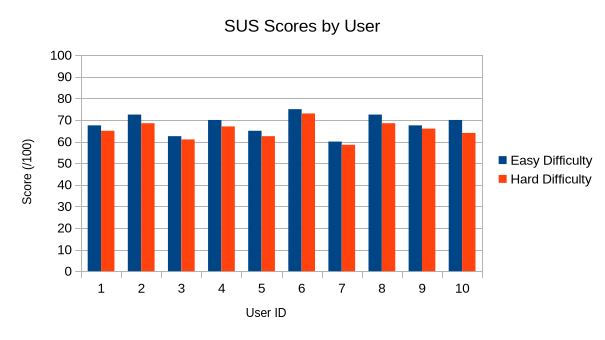

# 2026-group-19
2026 COMSM0166 group 19
Play Our Game!
>>  https://uob-comsm0166.github.io/2026-group-19/  <<

# COMSM0166 Project Template
A project template for the Software Engineering Discipline and Practice module (COMSM0166).

## Info

This is the template for your group project repo/report. We'll be setting up your repo and assigning you to it after the group forming activity. You can delete this info section, but please keep the rest of the repo structure intact.

You will be developing your game using [P5.js](https://p5js.org) a javascript library that provides you will all the tools you need to make your game. However, we won't be teaching you javascript, this is a chance for you and your team to learn a (friendly) new language and framework quickly, something you will almost certainly have to do with your summer project and in future. There is a lot of documentation online, you can start with:

- [P5.js tutorials](https://p5js.org/tutorials/) 
- [Coding Train P5.js](https://thecodingtrain.com/tracks/code-programming-with-p5-js) course - go here for enthusiastic video tutorials from Dan Shiffman (recommended!)

## Your Game (change to title of your game)

STRAPLINE. Add an exciting one sentence description of your game here.

IMAGE. Add an image of your game here, keep this updated with a snapshot of your latest development.

LINK. Add a link here to your deployed game, you can also make the image above link to your game if you wish. Your game lives in the [/docs](/docs) folder, and is published using Github pages. 

VIDEO. Include a demo video of your game here (you don't have to wait until the end, you can insert a work in progress video)

## Your Group


- Alexander Hoover, lv25122@bristol.ac.uk, ROLE
- Jui Cheng Ho, ax25117@bristol.ac.uk, ROLE
- Wei Lun Chang, jb25862@bristol.ac.uk, ROLE
- Chi-Wei Feng, yx25778@bristol.ac.uk, ROLE
- Johnny Fraser, qk18837@bristol.ac.uk, ROLE
- Oliver Parry, nf25715@bristol.ac.uk, ROLE 

## Project Report


### Introduction

- 5% ~250 words 
- Describe your game, what is based on, what makes it novel? (what's the "twist"?)
Our team outlined two main project ideas for potential development. The first game idea was based on the existing game Super Crate Box, and the second is based on the browser game Learn2Fly. Although both of these games are part of different genres, they share similarities in being 2D platformers with side-view perspective, being arcade-like in style and relatively fast-paced for the player.

Game 1: Super Crate Box
Main mechanics:
Fixed map arcade game, where the player controls a character equipped with weapons.
Scoring system is defined by picking up crates, which spawn randomly and periodically around the map. Picking up crates results in a counter incrementing, and being ultimately stored in a leaderboard.
Crates also contain a random weapon within, with weapons having their own unique attributes to fight against enemies.
Enemies spawn in through the top of the map, progress over platforms within the map, and if they collide with the player, the game ends.
Enemies differ in size between 'normal' sized enemies, which are smaller in hitbox and take 1 hit, and 'big' enemies, which are larger but take multiple hits to kill.
If enemies reach the bottom of the map, and fall through a gate at the bottom, they re-appear at the top again, only much faster in movement.
The music is retro/arcade, adding to the fast-paced nature of the game, and evoking a sense of nostalgia to older games of a similar genre.

Key strengths:
The core game mechanics are relatively simple, so there won't be the case of biting off more than we can chew. Moreover, we can implement the main features, and then work on adding our own twists to the game, iterating and further polishing as we go so that a seamless experience is achieved. The game is not so reliant on the quality of the graphics, so although we will all gain some experience creating our own visual entities, the quality of the graphics won't weigh down the implementation of other more important aspects of the game. This way development can continue to be refined simultaneous to the development of better graphics if need be.

Possible Twists:
Main twists would be changes to the environment in which the map is played. Adding wind which would affect bullet trajectory and physics as well as potentially the player would be interesting, which would occur at random points within the game for a specified amount of time. Similarly, limiting the perspective that the player can see from, for example removing lighting would be another interesting mechanic. In this way, the entire map would no longer be able to be seen in its entirety as usual, and instead the player is limited to seeing based on proximity from their player entity and which way they are facing. Changing gravity conditions is also a good twist, where the entire map flips, and the player has to traverse the map upside-down, with the enemies moving in the opposite direction.

### Requirements 
#### Genre Ideation & Investigation

The first stage of our development process was to identify what type of game we wanted to make.
To begin, we discussed what types of games we enjoyed engaging with, and ended up with a list of genres that we all felt had potential. We used dot-voting to rank our preferences, allowing three votes per person. This allowed us to avoid anchoring onto one person's opinion and acted as a natural risk assessment, resulting in the ‘Action-Arcade Platformer’ and ‘Launcher’ genres tied first place.

| Genre | Total Votes | Status |
| :--- | :---: | :--- |
| **Launcher** | 4 | **Selected for Further Investigation** |
| **Action-Arcade Platformer** | 4 | **Selected for Further Investigation** |
| **"Cozy" Sims / Farming Sims** | 3 | High Interest |
| **Roguelike (RPG)** | 3 | High Interest |
| **Puzzles** | 3 | High Interest |
| **Racing** | 2 | Low Interest |
| **Fighting / Action** | 2 | Low Interest |
| **Tower Defense** | 2 | Low Interest |
| **Survival / Crafting** | 1 | Dropped |
| ~~**Horror**~~ | - | Scratched |
| ~~**Exploration**~~ | - | Scratched |

Not wanting to pick a focus prematurely, we explored a range of games from each genre and, through another vote, selected Super Crate Box and Learn to Fly as the two that we would bring forward for user testing via a paper prototyping session.

By selecting the strongest archetype from each genre, we maximized the breadth of useful feedback we were able to get from our peers acting as surrogate stakeholders. This also allowed us to avoid asking leading questions and instead use comparative questions when eliciting users' preferences, in order to avoid confirmation bias.

<table>
  <tr>
    <td></td>
    <td></td>
  </tr>
    <tr>
    <td>Our favourite games with 'Arcade/Action platformer' elements </td>
    <td>A range of beloved games from the 'Launcher' genre</td>
  </tr>
</table>

#### Paper Prototyping Sessions
<table>
  <tr>
    <td></td>
    <td></td>
      </tr>
 <tr>
    <td>Action-Arcade Platformer Prototype</td>
    <td>Pingu's Day Out Prototype</td>
</tr>
</table>

These Paper Prototyping sessions provided critical data that shaped our final product. Users enjoyed the Super Crate Box concept, noting that it had clearer objectives and more intuitive game mechanics. This feedback, combined with the team's assessment of the project's Technical Scalability, led us to pivot away from the Launcher genre.

A standout success from the testing was the 'Lights Out!' mechanic seen above. Initially only a throwaway prototype, its popularity during user testing led us to prioritise it as a strong Should-Have requirement. It evolved into the 'Dark Mine' area in our final game, adding atmospheric depth and a unique challenge to the Level 1 environment.

#### Identification of Stakeholders


#### Epics and User Stories

We categorized our requirements into a range of Epics to ensure all stakeholder needs from our Onion Model were addressed. Sections of two epics are displayed below as examples of this process.


| Epic | User Stories | Acceptance Criteria |
| :--- | :---: | :--- |
| **Core Combat & Arcade Physics** | As a Player, I want responsive gravity and platform collision, so that movement feels precise and fair. | Given the player is in mid-air (not touching a platform), When the game loop updates, Then the player’s vertical velocity must increase by the gravity constant. |
|||Given the player is moving upward during a jump, When they collide with the underside of a platform, Then their vertical velocity must instantly reset to zero to prevent "clipping."|
||As a Player, I want to collect crates that instantly swap my weapon, so that the gameplay remains dynamic and challenging.|Given the player overlaps with a weapon crate, When the collision is detected, Then the crate must be removed from the canvas and the player's current weapon must be updated.|
|||Given the player presses the 'Shoot' key, When the time since the last shot is less than that specific weapon's coolDown value, Then no new projectile should be spawned.|
| **Inclusive Design (Accessibility)** | As a Player with motor impairments, I want to choose different parts of the control scheme independently from each other, so that I can play comfortably. | Given the player is in the settings menu, When they interact with the key configuration options, Then they must be able to choose between specific preset key mappings independently of each other. |
|||Given a specific control scheme has been selected and saved, When the player presses the designated keys in that scheme, Then the corresponding "Movement" or "Shoot" actions must trigger in-game.|
||As a Player with hearing impairments, I want visual feedback for key game events, so that I don't miss critical game-state changes. |Given the player character takes damage, When the health reduction occurs, Then the player must flash red simultaneously with any audio cues.|
|||Given the player collects a new weapon, When the crate is removed from the canvas, Then a text notification must appear in the UI.|

#### Epic 1: Core Combat & Arcade Physics
* **User Story 1.1:** As a Player, I want responsive gravity and platform collision, so that movement feels precise and fair.

    * **Acceptance Criteria 1.1.1:** Given the player is in mid-air (not touching a platform), When the game loop updates, Then the player’s vertical velocity must increase by the gravity constant.
    * **Acceptance Criteria 1.1.2:** Given the player is moving upward during a jump, When they collide with the underside of a platform, Then their vertical velocity must instantly reset to zero to prevent "clipping."
* **User Story 1.2:** As a Player, I want to collect crates that instantly swap my weapon, so that the gameplay remains dynamic and challenging.

    * **Acceptance Criteria 1.2.1:** Given the player overlaps with a weapon crate, When the collision is detected, Then the crate must be removed from the canvas and the player's currentWeapon variable must be updated.
    * **Acceptance Criteria 1.2.2:** Given the player presses the 'Shoot' key, When the time since the last shot is less than that specific weapon's coolDown value, Then no new projectile should be spawned.

#### Epic 3: Inclusive Design (Accessibility)
* **User Story 3.1:** As a Player with motor impairments, I want to choose different parts of the control scheme independently from each other, so that I can play comfortably.

    * **Acceptance Criteria 3.1.1:** Given the player is in the settings menu, When they interact with the key configuration options, Then they must be able to choose between specific preset key mappings independently of each other.
    * **Acceptance Criteria 3.1.2:** Given a specific control scheme has been selected and saved, When the player presses the designated keys in that scheme, Then the corresponding "Movement" or "Shoot" actions must trigger in-game.
* **User Story 3.2:** As a Player with hearing impairments, I want visual feedback for key game events, so that I don't miss critical game-state changes.

    * **Acceptance Criteria 3.2.1:** Given the player character takes damage, When the health reduction occurs, Then the player must flash red simultaneously with any audio cues.
    * **Acceptance Criteria 3.2.2:** Given the player collects a new weapon, When the crate is removed from the canvas, Then a text notification must appear in the UI.


#### User Personas

In order for us to be able to empathise with our users, and consider how development changes would impact different groups, we developed a range of distinct User Personas derived from our initial surrogate stakeholder feedback. 

This sped up development by allowing us to easily question what 'Sam the Sensitive Hearing Gamer' and other personas would think about a given change, and adjust accordingly. 


####  Project Prioritization - MoSCoW Analysis

| Feature | Effort | Value | MoSCoW Bucket | Rationale |
| :--- | :--- | :--- | :--- | :--- |
| **Core Physics & Gravity** | High | Critical | Must Have | The game is unplayable without stable physics, thus this is required for even the MVP. |
| **Randomized Weapon Crates** | Medium | High | Must Have | This is the main hook of the game, and forms the fundamental gameplay loop .|
| **Light's out Envimonmental Effect** | Medium | High | Should Have | This was a highly favoured feature during user testing that adds a unique twist to the game. |
| **Multiple Control Schemes** | Low | High | Should Have | Allows players with control related accessiblity needs to optimise their play. |
| **Visual Hit-Flash Feedback** | Low | Medium | Should Have | Aids deaf players who cannot hear the 'hurt' sound effect to play easily. |
| **Pause Menu & State Control** | Low | Medium | Should Have | Important for user control and allowing breaks without losing progress. |
| **Local High Score Saving** | Medium | Medium | Could Have | This would encourage replayability but is not required for an early game iteration. |
| **Online Global Leaderboard** | High | Medium | Won't Have | Leads to high server-side complexity and data protection considerations, with limited interest from playtesters. |

#### Use Case Diagram


### Design

With a set of preliminary requirements established for our game, we next turned to designing its architecture. During the 2026 BrisHack hackathon, our team experimented with a traditional object-oriented design using deep inheritance hierarchies. In this approach, a typical class structure might resemble:

```
GameObject → MovingEntity → Character → Player
```

While this design works adequately for small projects, we found that it did not scale well. Managing deep inheritance trees quickly became difficult, and the structure made it harder to reason about the relationships between classes. Additionally, we encountered the “God Class” problem, where individual classes accumulated large amounts of logic within a single file, making the code harder to maintain and extend.
For the development of our actual game, we therefore sought a design pattern that minimized inheritance, separated entity behaviour from the entities themselves, and remained conceptually simple. Based on these goals, we chose to implement an Entity–Component–System (ECS) architecture for the backend of our game.

#### Backend (Entity-Component-System)

Unlike the traditional object-oriented approach, where objects encapsulate both data and behaviour, ECS separates the game into three distinct and loosely coupled parts. 

- <strong>Entities:</strong>
An entity is simply a unique integer identifier. By itself, an entity contains no data or behaviour.

- <strong>Components:</strong>
Components store data but contain no logic. For example, a position component may store an entity’s x and y coordinates. Components are typically represented as lightweight structures.

- <strong>Systems:</strong>
Systems contain the game’s logic. Each system queries the ECS “database” for entities that possess a specific combination of components, then applies the relevant behaviour to those entities.

The images below show this design pattern conceptually.

*ECS Conceptual Class Diagram*


*Entity Component Database within ECS Class*


This architecture provides several additional benefits. The ECS database can be organized so that components are stored contiguously in memory, improving cache locality and overall performance. Achieving this level of memory efficiency is far more difficult with traditional object-oriented designs. Furthermore, ECS makes it easy to add new functionality. Rather than modifying existing class hierarchies, new behaviour can be introduced by defining a new component and system, then attaching the component to relevant entities. This modular structure enables rapid development of new features without requiring significant refactoring of existing code. The complete backend class diagram can be seen below.

*Backend Class Diagram*


#### Front End

Early in the design process, we used sequence diagrams to conceptualise how the menu system should function, mapping out transitions between screens before any code was written. The diagram below illustrates a typical user journey through the game, from the title screen to gameplay and back again. By tracing the player’s path across different scenes, we identified which state needed to be preserved and chose an appropriate design pattern to support these transitions.

This process informed key decisions—for example, overlaying the pause menu on top of the live game rather than replacing it, allowing for a seamless resume experience. During gameplay, the player interacts directly with the game world while the system responds in real time. If the player dies, a Game Over screen is displayed, offering the choice to retry the level or return to the main menu, thereby completing the loop. Overall, this approach provided a strong foundation to build upon as development progressed.

*Frontend Example Sequence Diagram*


The game uses a Scene Manager pattern to control which screen is shown at any time, such as the main menu, gameplay, or pause screen. Each screen is represented as a "Scene" object with a common set of methods: **setup** to initialise, **update** to run logic, **display** to render, and **dispose** to clean up. A central SceneManager holds a reference to whichever scene is currently active and forwards every frame update and input event to it, keeping the rest of the codebase decoupled from scene-specific logic. This approach makes it straightforward to add new screens independently and keeps each scene's logic self-contained.

*Frontend Class Diagram*


### Implementation

Our implementation of CrateBox is grounded in two key areas of technical challenge that shaped both the architecture and the development process: building a functional Entity–Component–System (ECS) engine from scratch, and ensuring the game maintains consistent visual and physical quality across different screen sizes and zoom levels.

#### Challenge 1: Implementing an Entity–Component–System (ECS) Architecture

As described in the Design section, we adopted an ECS architecture to avoid the pitfalls of deep inheritance hierarchies. While the theory behind ECS is straightforward, translating it into a working game engine required careful design decisions and several rounds of iteration.

Our ECS core (`src/ecs/ecs.js`) stores components in a two-level `Map`: the outer key is the component class itself, and the inner key is the integer entity ID. This allows systems to query the "ECS database" with `getEntitiesWith(...componentClasses)`, retrieving only entities that possess a specific combination of components — the fundamental operation that drives all game logic. For example, the `PhysicsSystem` queries for entities with `Position`, `Velocity`, and `Acceleration`, while the `RenderSystem` queries for entities with `Position` and `Renderable`. This separation means rendering logic has zero knowledge of physics, and physics logic has zero knowledge of input — each system is fully self-contained.

Components themselves are plain data holders with no logic: `Position` stores `x`, `y`, `width`, and `height`; `Velocity` stores `vx` and `vy`; `Animation` holds sprite sheet metadata and runtime playback state. New game behaviours are introduced not by modifying existing classes, but by defining a new component and system. For instance, adding the death tumble effect for enemies only required a `Dying` component to store rotation state, and a few lines in the `RenderSystem` to handle entities that carry that component — no existing code was touched.

The biggest practical challenge was managing entity lifecycle safely. Removing an entity or adding components mid-update could corrupt the very collections being iterated by a system. We resolved this with a `SpawningSystem`: instead of creating or destroying entities directly, systems post a `SpawnRequest` component onto a staging entity, and the `SpawningSystem` flushes all pending requests at the start of each frame before any game logic runs. This guarantees that entity creation and destruction never interfere with an in-progress system update.

Systems are executed in a deliberate fixed order each frame: enemy and box spawning → input → weapons → spawning flush → interactions → floating enemy AI → physics → animation → projectiles → rendering. This ordering ensures, for example, that newly spawned entities are fully initialised before the physics or render systems process them.

A further benefit that emerged during development was rapid prototyping. Adding the blood droplet particle effect, the weapon pickup HUD notification, and the floating enemy seek behaviour each took less than a day, because each required only a new component and a small system or an addition to an existing one — no class hierarchies needed refactoring.

#### Challenge 2: Maintaining Game Quality When Zooming In and Out

A core requirement was that the game should feel identical regardless of the player's browser window size. With a purely pixel-based approach, shrinking the window would slow the physics or distort level geometry; enlarging it would cause entities to behave differently. We addressed this through a unified coordinate scaling system.

The canvas is sized to fill the viewport while preserving a fixed 16:9 aspect ratio (`src/sketch.js`). If the window is too wide, the canvas height fills the screen and the width is computed from the ratio; if the window is too tall, the reverse applies. Letterboxing fills the remaining space with a dark background, keeping the game area consistently proportioned.

All game positions and sizes are defined in normalised grid units on a 32×18 grid (`src/config/level_factory.js`). The conversion from grid to pixels is:

```
pixelX = (gridCol / 32) × canvasWidth
pixelY = (gridRow / 18) × canvasHeight
```

Critically, this same scaling is applied to every physics constant at level load time (`src/game.js`): gravity, player speed, jump velocity, terminal velocity, projectile speed, and enemy speed are all multiplied by the corresponding canvas dimension before being passed to the systems. Entity sizes stored in `src/config/defaults.js` as fractional grid units (e.g. player width = 0.8 grid units) are similarly converted to pixels on spawn. As a result, a player moving at 0.2 grid units per frame will cover the same fraction of the screen regardless of whether the canvas is 960×540 or 1920×1080 — the game feels identical at any resolution.

On the rendering side, `noSmooth()` is called on canvas creation to prevent sub-pixel blurring of sprite art when scaling. The wall texture tiling is pre-rendered into a single off-screen graphics buffer sized to the current canvas, so wall geometry is always crisp and never re-computed per frame. Sprite sheet frames scale proportionally with entity dimensions, maintaining visual fidelity without requiring multiple asset resolutions.

### Evaluation

As part of the development process, the game went through several rounds of evaluation to ensure that the software was meeting the user requirements we had set out to achieve previously. In order to do this effectively, we assessed the game using a variety of methods, both quantitative and qualitative, to give us the clearest picture possible of any potential usability issues whilst minimising the weaknesses that any one method may have in assessing such issues.

#### Qualitative Evaluation: Think-Aloud

From early on in the development of the game, we began to use the **Think-Aloud** method. This was employed in an iterative manner, where changes were rolled out and then tested amongst users before making it into the final product. This ensured that the game remained consistently aligned with user requirements. Sixteen participants were gathered in total from workshops and a Testathon. During this evaluation, users were asked to navigate around the map, interact with enemy entities, and pick up crates that spawned around the map, whilst we recorded their verbalisations to the environment. Some of the verbalisations are listed as follows:

*   **Smooth Movement:** Most users found the player character movements to be smooth and enjoyable.
*   **Threat Perception:** Some users found the enemy entities’ movements to be fluid; however, since player death was not yet implemented in early versions, some users questioned the threat level of the enemies.
*   **Navigation:** Most users found it easy to navigate the map, pick up crates, and avoid enemies. There were no issues with identifying enemies vs. the player.
*   **Difficulty Scaling:** The scaling of difficulty over time was contentious; some users liked the increasing enemy speed, while others felt more was needed to incite a real element of danger.
*   **Goal Clarity:** Some users questioned the overall goals or win conditions. Without player death or a score tracker, there was little incentive to kill enemies or continue playing the game.
*   **Map Bounds:** A few users were able to maneuver the player character out of the bounds of the map.
*   **Pathing Exploits:** One user was able to avoid contacting any enemies by positioning the character in an area of the map where no enemies pathed to.

#### Quantitative Analysis: System Usability Scale (SUS)

After having gathered important data as to the user experience, and having ironed out issues highlighted by users in the qualitative evaluation, we sought to assess whether the user experience reflected these improvements. More specifically, whether our changes to the game had created an environment which successfuly reflected the sense of danger we wished to instill in the player, and a stronger sense of the overall win conditions. We also wanted to see if we had created a significant difference in the user workload as the difficulty changed. In order to test this, quantitative methods would be used to be able to measure the differences in difficulty in empirical terms, and reduce the subjectivity of testers. We chose to use the System Usability Scale (SUS) evaluation method. Whilst the NASA Task Load Index (TLX) is widely recognised as being an accurate measure of user workload between different difficulties, any conclusions gathered from the data would not be that relevant to us. We were aiming to improve overall usability between all difficulty levels instead, and the System Usability Scale is a much better method for this purpose.

System Usability Scale (SUS)
Ten users were gathered at random to carry out two SUS questionnaires, comparing “Easy” and “Hard” difficulty levels. As outlined above, we were looking for high usability scores to highlight that users were finding the overall game intuitive, and that changes made had led to a positive user experience.

<div align="center">

| User | Easy Difficulty | Hard Difficulty | Difference (Δ) |
| :--- | :--- | :--- | :--- |
| 1 | 67.5 | 65 | -2.5 |
| 2 | 72.5 | 68.5 | -4 |
| 3 | 62.5 | 61 | -1.5 |
| 4 | 70 | 67 | -3 |
| 5 | 65 | 62.5 | -2.5 |
| 6 | 75 | 73 | -2 |
| 7 | 60 | 58.5 | -1.5 |
| 8 | 72.5 | 68.5 | -4 |
| 9 | 67.5 | 66 | -1.5 |
| 10 | 70 | 64 | -6 |
| **Average** | **68.25** | **65.4** | **-2.85** |

</div>


<p align="center">
    
    <br>
    <em> Comparison of System Usability Scale (SUS) Scores across Easy and Hard difficulties.</em>
    </p>

#### Performance Analysis & Interpretation

Calculating the p-value with the **Mann-Whitney U Test** gave us a value of **0.1849**. Given that our threshold was 0.05, we determined that the change in difficulty did not result in a statistically significant change in the game’s usability. 

**What does this mean?**
The overall scores (68.25 and 65.4) place the game right at the industry average of 68. This told us:

Overall, we had been successful in ensuring that our game was usable for users, and that we had fixed the previous issues with collisions and moving out of the map bounds. The small difference in usability between difficulties- despite the small drop for the hard difficulty- highlighted to us that difficulty was being implemented correctly. The game remained usable regardless of difficulty, users understood the danger posed by enemies, were not finding frustrating bugs within the game, and a harder difficulty did not lead to a worse user experience. Nevertheless, these middling scores did indicate to us some areas needing improvement. Users reported that the game could benefit from better accessibility, more specifically the ability to change controls according to user preference. Another user highlighted that the appearance of the game’s enemies and box assets could be improved to make it more intuitive what needed to be picked up and what needed to be avoided.

Despite this, we considered our efforts a success since issues we had set out to solve had no longer become the bottleneck in the game’s development process. We were able to successfully instill a sense of danger within the player through enemies that now were considered threats, and, through the increased difficulty, users were more naturally inclined to pursue the win conditions and goals that we set out for the game. These evaluative methods and the user feedback within proved invaluable in helping to keep our game aligned with the user requirements.

### Process 

#### Team Roles & Division of Labor
To manage the complexity of building a game in p5.js from scratch, we divided our team into two primary domains: **Frontend** and **Backend**. 
* **Frontend:** Focused on the visual layer, including character animations, environment rendering (backgrounds and platforms), and UI elements.
* **Backend:** Handled the game logic and mathematical constraints, including character and enemy movement physics, collision detection, and weapon shooting mechanisms.

#### Methodology & Collaborative Tools
* **Agile Development:** We employed Agile methodologies to keep our iterative development organized. Using **Jira**, we maintained a **Kanban** board and managed our sprints. During our weekly Tuesday planning sessions, we brainstormed objectives and created Jira tickets. To prevent task overlap, team members estimated time limits for their assigned cards, helping us gauge the complexity of each sprint. We also used **Google Docs** to document sprint goals, ensuring the entire team remained aligned on individual responsibilities.
  
    

* **Visual Prototyping:** For the frontend design, we utilized **Miro** as a collaborative whiteboard. This allowed all team members, regardless of their technical role, to sketch out visual concepts and iterate on UI/UX ideas freely during discussions.

    

#### Technical Workflow
To maintain a high standard of code quality and a clean project history, we implemented a rigorous version control strategy:
* **Git Flow:** Work was strictly assigned via dedicated `feature/` branches. We also utilized `fix/` branches to address bugs discovered after a feature had been merged.
* **Commit Message Style:** We defined a standardized commit message style to maintain a clear, readable, and highly organized version history. By categorizing our updates with semantic prefixes such as `feat:` (for new features), `fix:` (for bug resolutions), and `chore:` (for maintenance or configuration updates), team members could instantly understand the purpose of a change at a glance. This practice significantly streamlined our code reviews and made tracking down specific updates during debugging much easier.
* **Linear History:** We prioritized rebasing over merging to ensure our Git history remained linear. This made it much easier to audit and track changes as complex modular systems (like the `ProjectileSystem` and `WeaponSystem`) were integrated.
  
    
    

* **Code Review:** Every Pull Request required at least one approval from a teammate before merging into the main branch. This ensured that everyone stayed informed about recent updates and could provide feedback on core components like the `EntityFactory`. We also utilized **GitHub Copilot** as an AI assistant to help identify edge cases during code reviews.

#### Reflections & Adaptations
While our Agile framework provided a strong foundation, the reality of development presented several challenges that required us to adapt our working style:

* **Challenge: Task Overlap & Ambiguity**
    * **What Didn't Work:** Because we were all navigating game development and p5.js for the first time, initial task boundaries were blurry. Teammates occasionally modified shared files independently, leading to divergent logic and confusion.
    * **How We Adapted:** We shifted to a more immediate communication style using our **WhatsApp Group** to flag file modifications in real-time. More importantly, we introduced **pair programming** sessions. This not only prevented overlapping work but also allowed us to share ideas and standardize our coding styles across the frontend and backend boundaries.

* **Challenge: Feature Creep & Idea Convergence**
    * **What Didn't Work:** During brainstorming, our team tended to be overly ambitious. We frequently proposed complex mechanics without knowing if they were technically viable, which stalled early prototyping.
    * **How We Adapted:** We implemented a "verify early" rule. Instead of debating complex ideas abstractly, we forced ourselves to either draw a simplified, structural flow on **Miro** or build a bare-bones code proof-of-concept. This grounded our creativity in technical reality.

* **Challenge: Git Conflicts**
    * **What Didn't Work:** Frequent rebasing initially resulted in overwhelming merge conflicts, as isolated tasks ended up interacting with the same core game loops. 
    * **How We Adapted:** We learned that working in silos is dangerous in game development. When a conflict arose, we stopped resolving them in isolation and immediately initiated quick sync calls with the involved teammates to negotiate the merge. This fundamentally changed our mindset: we learned to constantly read each other's code to anticipate integration points *before* pushing our branches, drastically reducing integration risks later in the project.

### Conclusion
- The CrateBox project has been a massive undertaking. At the early stage, we discussed and set the tone of the whole development process. Instead of using the heavily inherited Object-Oriented-Programming structure, we adopted an unfamiliar design pattern - Entity-Component-System (ECS), which gave us a hard time to learn it in the beginning, but huge development benefits later down the road. Moreover, we implemented change control policies for our Github repo, which meant someone needed to review the code before any pull-request being merged or rebased into the main branch, and had standard formatting for the commit messages. 
These all helped us collaborate more easily and smoothly. 

- Throughout the project, we had regular meetings each week, using Jira to monitor the progress of the project, and Git to preserve the stages of code development. We followed the coding style we had been taught in C and Java - the importance of good code structure, well-designed classes, DRY code, descriptive variable and function names. We refactored the code frequently, which made it more succinct and easy to understand. Many challenges were overcome during the development. From the design of different scenes, to the logic of floating enemies, to maintaining the same game quality when zooming in and out the screen, etc. We grew and sharpened our coding skills along the way, and worked collaboratively through those bottlenecks. 

- For future design of the CrateBox, we would like to integrate some of features we discussed in the beginning, but assessed to be too complex to deliver in the limited timeframes. For instance, the multiplayer feature, which makes the game more interactive, or adding more weapon types like landmine, sword, and grenade, which brings more diversity into the game. Currently, The CrateBox has three types of scenes - cave, iced, and sea, each one has totally different environment settings, we can bring more themes like jungle, or urban into it. We believe those features with some special effects will be able to boost the enjoyment of the game. 

- To conclude, we greatly enjoyed working together to create CrateBox. None of us had prior experience of game development, so the whole journey was more like trial-and-error, but the design decisions we made early on, especially adopting ECS, proved to be the foundation that carried us through. Eventually, we understood a new design pattern, implemented what we had learnt in other courses, and strengthened Git and Github, which integrated the whole knowledge into one project. We are very proud of what we were able to deliver. It's a phenomenal experience.

### Contribution Statement

- Provide a table of everyone's contribution, which *may* be used to weight individual grades. We expect that the contribution will be split evenly across team-members in most cases. Please let us know as soon as possible if there are any issues with teamwork as soon as they are apparent and we will do our best to help your team work harmoniously together.

### Additional Marks

You can delete this section in your own repo, it's just here for information. in addition to the marks above, we will be marking you on the following two points:

- **Quality** of report writing, presentation, use of figures and visual material (5% of report grade) 
  - Please write in a clear concise manner suitable for an interested layperson. Write as if this repo was publicly available.
- **Documentation** of code (5% of report grade)
  - Organise your code so that it could easily be picked up by another team in the future and developed further.
  - Is your repo clearly organised? Is code well commented throughout?
