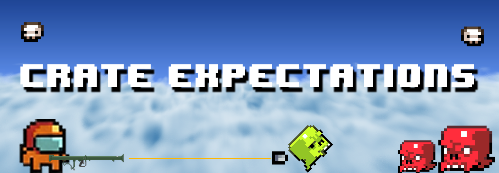

**Outrun, outshoot, and outlast the growing chaos!**

[CLICK HERE TO PLAY!](https://uob-comsm0166.github.io/2026-group-19/)

VIDEO. Include a demo video of your game here (you don't have to wait until the end, you can insert a work in progress video)

# Table of Contents
1. [Development Team](#1-development-team)
2. [Introduction](#2-introduction)
3. [Requirements](#3-requirements)
4. [Design](#4-design)
5. [Implementation](#5-implementation)
6. [Evaluation](#6-evaluation)
7. [Process](#7-process)
8. [Sustainability](#8-sustainability)
9. [Conclusion](#9-conclusion)
10. [Contribution Statement](#10-contribution-statement)
11. [References](#11-references)


# 1. Development Team


| Name          | Email                 | Primary Roles                          |
| ------------- | --------------------- | -------------------------------------- |
| Alex Hoover   | lv25122@bristol.ac.uk | Backend, ECS Framework, Physics System |
| Jui Cheng Ho  | ax25117@bristol.ac.uk |                                        |
| Wei Lun Chang | jb25862@bristol.ac.uk |                                        |
| Chi-Wei Feng  | yx25778@bristol.ac.uk |                                        |
| Johnny Fraser | qk18837@bristol.ac.uk |                                        |
| Oliver Parry  | nf25715@bristol.ac.uk |                                        |


# 2. Introduction

Our game "Crate Expectations", followed by an astronaut who encountered an airplane crashed, being sended to different harsh terrains and various enemies. In order to survive, he has to fight against the evil aliens and collect as many boxes as possible.

Crate Expectations is based on "Super Crate Box", which is a fast-paced, 2D arcade shooting game, prioritizing picking up crates, and killing the aliens which get in the way. Scoring system is defined by picking up crates, which spawn randomly and periodically around the map. Picking up crates results in a counter incrementing. Crates also contain a random weapon within, Each weapon has their own unique attributes to fight against enemies. In our game, we introduced four types of weapons - Shotgun, DISC, TwoWayRifle, and Rocket. We added recoil value and cooling time, so player shouldn't trigger too happily, or they wouldn't be able to shot down the enemy. 
<p align="center">
  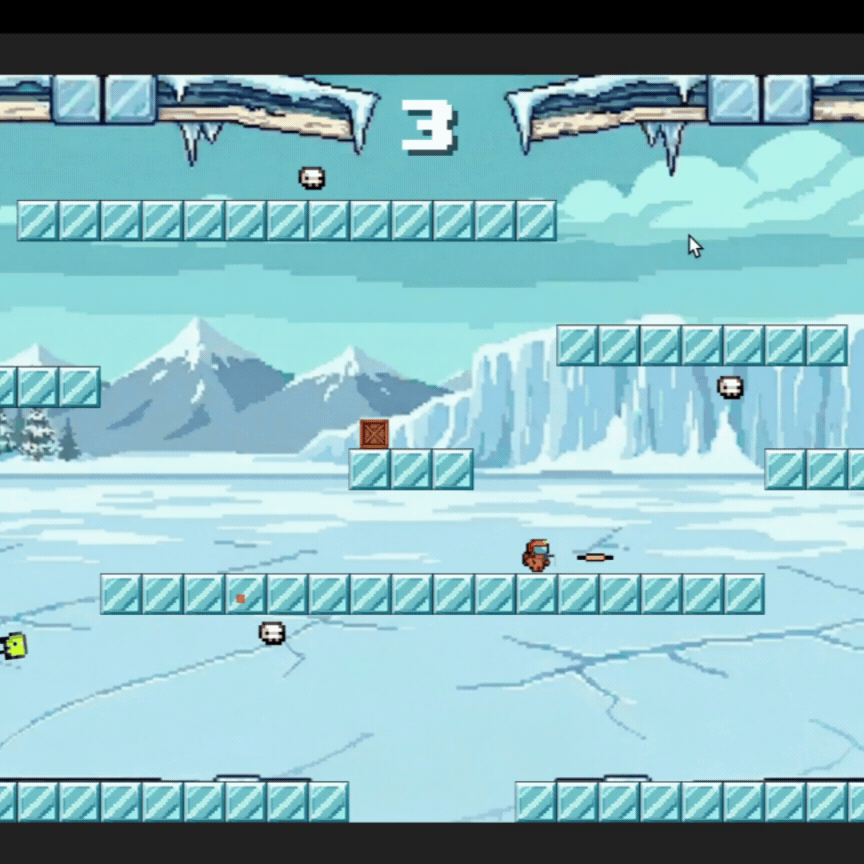
</p>

Moreover, in "Crate Expectations" we added three special scenes, each scene has its own customized setting. The 'Cave Scene', which lower the visibility of surrounding, adding the difficulty on collecting boxes and seeing enemies. The 'Ice Scene', introducing sliding effect on the terrain, making player's movement harder. The 'Space Scene', we imitated the actual space environment, eliminating the gravity feature, for the better or worse, it's highly depended on the player's skill.
<table width="100%">
  <tr>
    <td width="33.33%">
      
    </td>
    <td width="33.33%">
      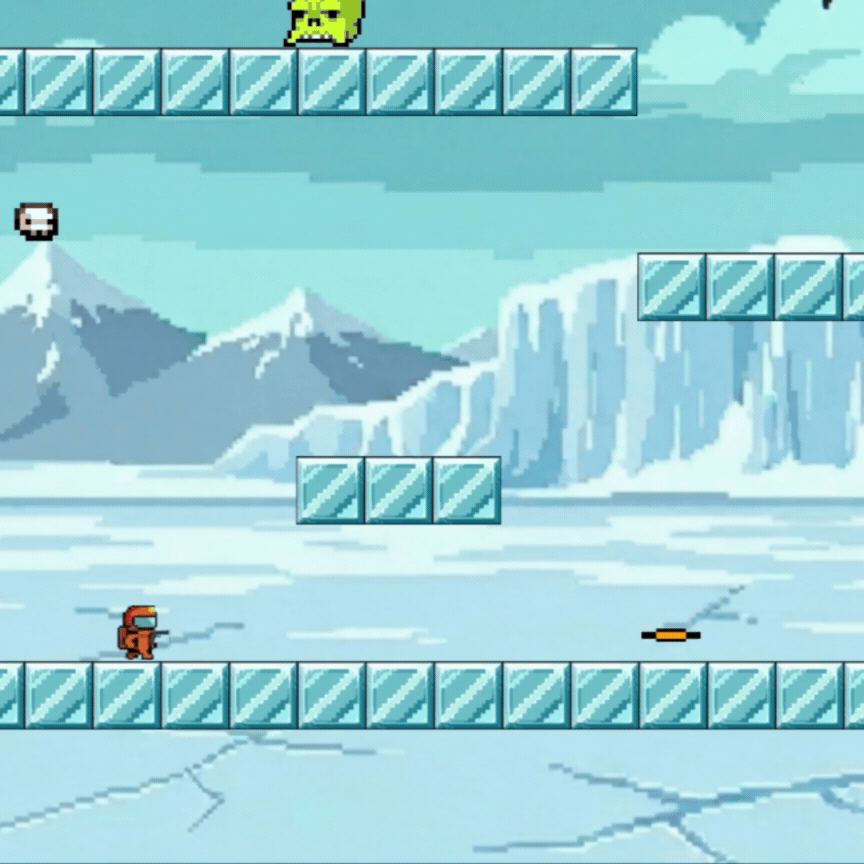
    </td>
    <td width="33.33%">
      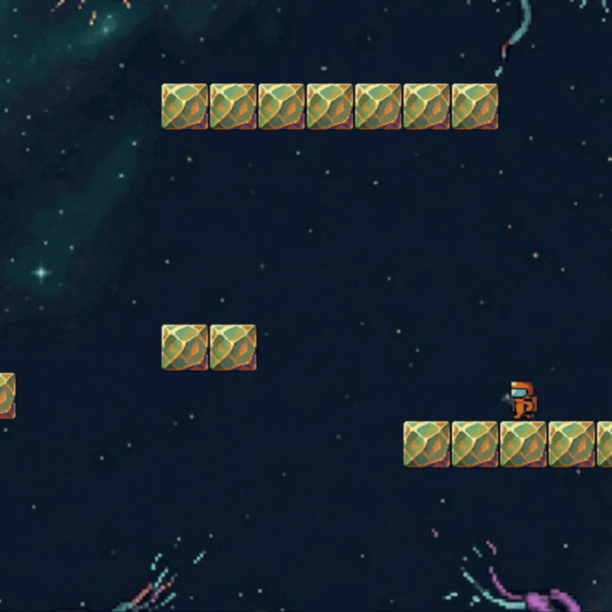
    </td>
  </tr>
</table>

Along with many more of our own features such as adding live feature, customizing  environments settings, and user interface, we believe that Crate Expectations offers an advantuous and trilled experience to players of all ability levels. We hope that our game can be enjoyed by all.

# 3. Requirements 
## Genre Ideation & Investigation

The first stage of our development process was to identify what type of game we wanted to make. To begin, we discussed what types of games we enjoyed engaging with, and ended up with a list of genres that we all felt had potential. We used dot-voting to rank our preferences, allowing three votes per person. This allowed us to avoid anchoring onto one person's opinion and acted as a natural risk assessment, resulting in the ‘Action-Arcade Platformer’ and ‘Launcher’ genres tied first place.

| Genre | Total Votes | Status |
| :--- | :---: | :--- |
| **Launcher** | 4 | **Selected for Further Investigation** |
| **Action-Arcade Platformer** | 4 | **Selected for Further Investigation** |
| **"Cozy" Sims / Farming Sims** | 3 | High Interest |
| **Roguelike (RPG)** | 3 | High Interest |
| **Puzzles** | 3 | High Interest |
| **Racing** | 2 | Low Interest |
| **Fighting / Action** | 2 | Low Interest |
| **Tower Defense** | 2 | Low Interest |
| **Survival / Crafting** | 1 | Dropped |
| ~~**Horror**~~ | - | Scratched |
| ~~**Exploration**~~ | - | Scratched |

Not wanting to pick a focus prematurely, we explored a range of games from each genre and, through another vote, selected Super Crate Box and Learn to Fly as the two that we would bring forward for user testing via a paper prototyping session.

By selecting the strongest archetype from each genre, we maximized the breadth of useful feedback we were able to get from our peers acting as surrogate stakeholders. This also allowed us to avoid asking leading questions and instead use comparative questions when eliciting users' preferences, in order to avoid confirmation bias.

<table>
  <tr>
    <td></td>
    <td></td>
  </tr>
    <tr>
    <td>Our favourite games with 'Arcade/Action platformer' elements </td>
    <td>A range of beloved games from the 'Launcher' genre</td>
  </tr>
</table>

## Paper Prototyping Sessions
<table>
  <tr>
    <td></td>
    <td></td>
      </tr>
 <tr>
    <td>Action-Arcade Platformer Prototype</td>
    <td>Pingu's Day Out Prototype</td>
</tr>
</table>

These Paper Prototyping sessions provided critical data that shaped our final product. Users enjoyed the Super Crate Box concept, noting that it had clearer objectives and more intuitive game mechanics. This feedback, combined with the team's assessment of the project's Technical Scalability, led us to pivot away from the Launcher genre.

A standout success from the testing was the 'Lights Out!' mechanic seen above. Initially only a throwaway prototype, its popularity during user testing led us to prioritise it as a strong Should-Have requirement. It evolved into the 'Dark Mine' area in our final game, adding atmospheric depth and a unique challenge to the Level 1 environment.

## Identification of Stakeholders


## Epics and User Stories

We categorized our requirements into a range of Epics to ensure all stakeholder needs from our Onion Model were addressed. Sections of two epics are displayed below as examples of this process.

<table>
  <thead>
    <tr>
      <th>Epic</th>
      <th>User Stories</th>
      <th>Acceptance Criteria</th>
    </tr>
  </thead>
  <tbody>
    <tr>
      <td rowspan="4"><b>Core Combat & Arcade Physics</b></td>
      <td rowspan="2">As a Player, I want responsive gravity and platform collision, so that movement feels precise and fair.</td>
      <td>Given the player is in mid-air (not touching a platform), When the game loop updates, Then the player’s vertical velocity must increase by the gravity constant.</td>
    </tr>
    <tr>
      <td>Given the player is moving upward during a jump, When they collide with the underside of a platform, Then their vertical velocity must instantly reset to zero to prevent "clipping."</td>
    </tr>
    <tr>
      <td rowspan="2">As a Player, I want to collect crates that instantly swap my weapon, so that the gameplay remains dynamic and challenging.</td>
      <td>Given the player overlaps with a weapon crate, When the collision is detected, Then the crate must be removed from the canvas and the player’s current weapon must be updated.</td>
    </tr>
    <tr>
      <td>Given the player presses the ‘Shoot’ key, When the time since the last shot is less than that specific weapon’s coolDown value, Then no new projectile should be spawned.</td>
    </tr>
    <tr>
      <td rowspan="4"><b>Inclusive Design (Accessibility)</b></td>
      <td rowspan="2">As a Player with motor impairments, I want to choose different parts of the control scheme independently from each other, so that I can play comfortably.</td>
      <td>Given the player is in the settings menu, When they interact with the key configuration options, Then they must be able to choose between specific preset key mappings independently of each other.</td>
    </tr>
    <tr>
      <td>Given a specific control scheme has been selected and saved, When the player presses the designated keys in that scheme, Then the corresponding "Movement" or "Shoot" actions must trigger in-game.</td>
    </tr>
    <tr>
      <td rowspan="2">As a Player with hearing impairments, I want visual feedback for key game events, so that I don’t miss critical game-state changes.</td>
      <td>Given the player character takes damage, When the health reduction occurs, Then the player must flash red simultaneously with any audio cues.</td>
    </tr>
    <tr>
      <td>	Given the player collects a new weapon, When the crate is removed from the canvas, Then a text notification must appear in the UI.</td>
    </tr>
  </tbody>
</table>

## User Personas

In order for us to be able to empathise with our users, and consider how development changes would impact different groups, we developed a range of distinct User Personas derived from our initial surrogate stakeholder feedback. 

This sped up development by allowing us to easily question what ‘Sam the Sensitive Hearing Gamer’ and other personas would think about a given change, and adjust accordingly. 


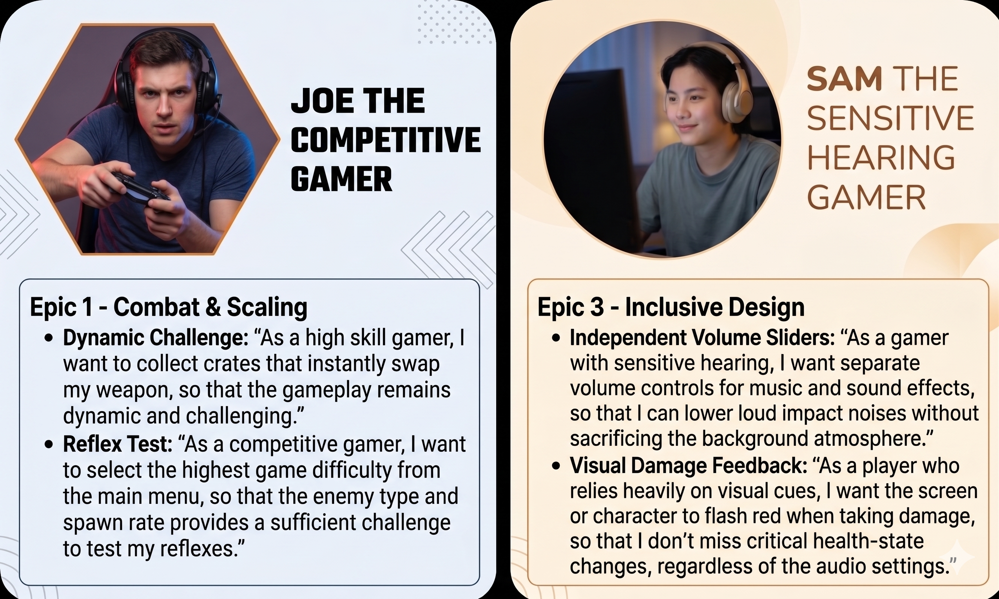

##  Project Prioritization - MoSCoW Analysis

| Feature | Effort | Value | MoSCoW Bucket | Rationale |
| :--- | :--- | :--- | :--- | :--- |
| **Core Physics & Gravity** | High | Critical | Must Have | The game is unplayable without stable physics, thus this is required for even the MVP. |
| **Randomized Weapon Crates** | Medium | High | Must Have | This is the main hook of the game, and forms the fundamental gameplay loop .|
| **Light's out Envimonmental Effect** | Medium | High | Should Have | This was a highly favoured feature during user testing that adds a unique twist to the game. |
| **Multiple Control Schemes** | Low | High | Should Have | Allows players with control related accessibility needs to optimise their play. |
| **Visual Hit-Flash Feedback** | Low | Medium | Should Have | Aids deaf players who cannot hear the 'hurt' sound effect to play easily. |
| **Pause Menu & State Control** | Low | Medium | Should Have | Important for user control and allowing breaks without losing progress. |
| **Local High Score Saving** | Medium | Medium | Could Have | This would encourage replayability but is not required for an early game iteration. |
| **Online Global Leaderboard** | High | Medium | Won't Have | Leads to high server-side complexity and data protection considerations, with limited interest from play testers. |

## Use Case Diagram


# 4. Design

With a set of preliminary requirements established for our game, we next turned to designing its architecture. During the 2026 BrisHack hackathon, our team experimented with a traditional object-oriented design using deep inheritance hierarchies. In this approach, a typical class structure might resemble:

```
GameObject → MovingEntity → Character → Player
```

While this design works adequately for small projects, we found that it did not scale well. Managing deep inheritance trees quickly became difficult, and the structure made it harder to reason about the relationships between classes. Additionally, we encountered the “God Class” problem, where individual classes accumulated large amounts of logic within a single file, making the code harder to maintain and extend.

For the development of our actual game, we therefore sought a design pattern that minimized inheritance, separated entity behaviour from the entities themselves, and remained conceptually simple. Based on these goals, we chose to implement an Entity–Component–System (ECS) architecture for the backend of our game.

## Backend (Entity-Component-System)

Unlike the traditional object-oriented approach, where objects encapsulate both data and behaviour, ECS separates the game into three distinct and loosely coupled parts. ECS also prioritises composition over inheritance.

- <strong>Entities:</strong>
An entity is simply a unique integer identifier. By itself, an entity contains no data or behaviour.

- <strong>Components:</strong>
Components store data but contain no logic. For example, a position component may store an entity’s x and y coordinates. Components are typically represented as lightweight structures.

- <strong>Systems:</strong>
Systems contain the game’s logic. Each system queries the ECS “database” for entities that possess a specific combination of components, then applies the relevant behaviour to those entities.

The images below show this design pattern conceptually.

*ECS Conceptual Class Diagram*

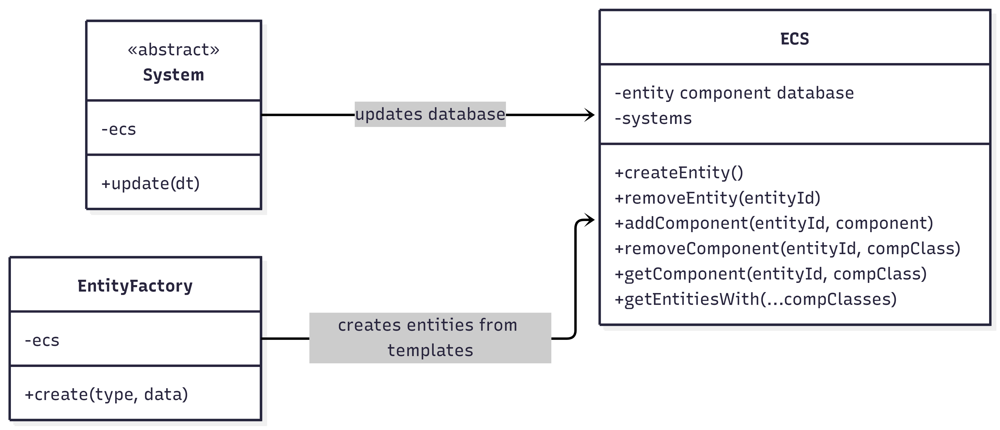

*Entity Component Database within ECS Class*

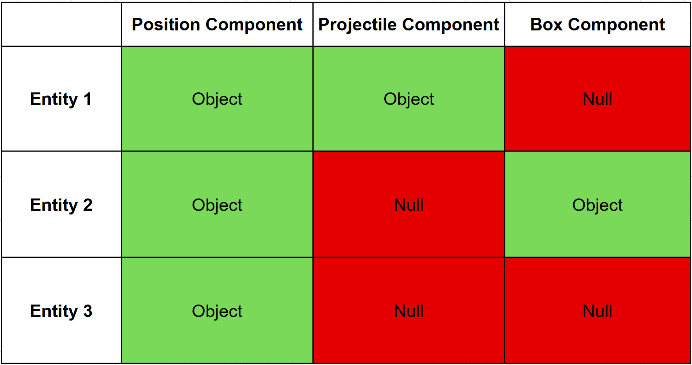

This architecture provides several additional benefits. The ECS database can be organized so that components are stored contiguously in memory, improving cache locality and overall performance. Achieving this level of memory efficiency is far more difficult with traditional object-oriented designs. Furthermore, ECS makes it easy to add new functionality. Rather than modifying existing class hierarchies, new behaviour can be introduced by defining a new component and system, then attaching the component to relevant entities. This modular structure enables rapid development of new features without requiring significant refactoring of existing code. The complete backend class diagram can be seen below.

*Backend Class Diagram*
[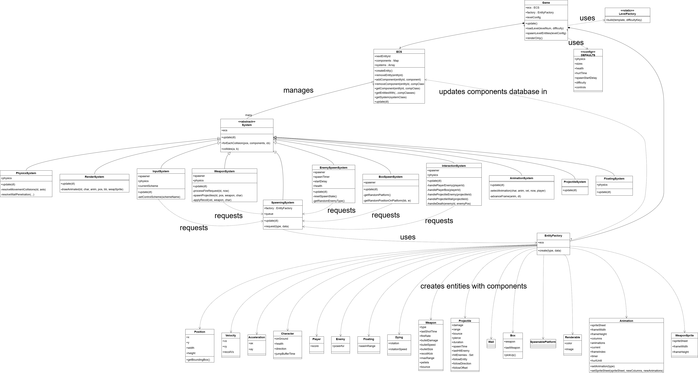](image/full-class-diagram.png)

## Front End

Early in the design process, we used sequence diagrams to conceptualise how the menu system should function, mapping out transitions between screens before any code was written. The diagram below illustrates a typical user journey through the game, from the title screen to gameplay and back again. By tracing the player’s path across different scenes, we identified which state needed to be preserved and chose an appropriate design pattern to support these transitions.

This process informed key decisions—for example, overlaying the pause menu on top of the live game rather than replacing it, allowing for a seamless resume experience. During gameplay, the player interacts directly with the game world while the system responds in real time. If the player dies, a Game Over screen is displayed, offering the choice to retry the level or return to the main menu, thereby completing the loop. Overall, this approach provided a strong foundation to build upon as development progressed.

*Frontend Example Sequence Diagram*

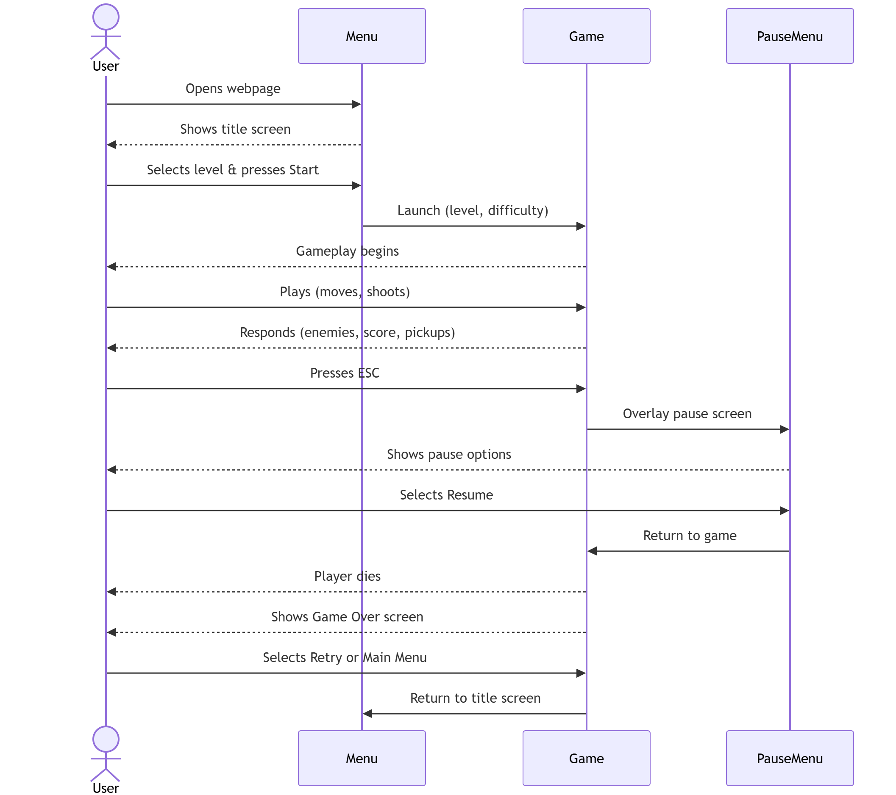

The game uses a Scene Manager pattern to control which screen is shown at any time, such as the main menu, gameplay, or pause screen. Each screen is represented as a "Scene" object with a common set of methods: **setup** to initialise, **update** to run logic, **display** to render, and **dispose** to clean up. A central SceneManager holds a reference to whichever scene is currently active and forwards every frame update and input event to it, keeping the rest of the codebase decoupled from scene-specific logic. This approach makes it straightforward to add new screens independently and keeps each scene's logic self-contained.

*Frontend Class Diagram*

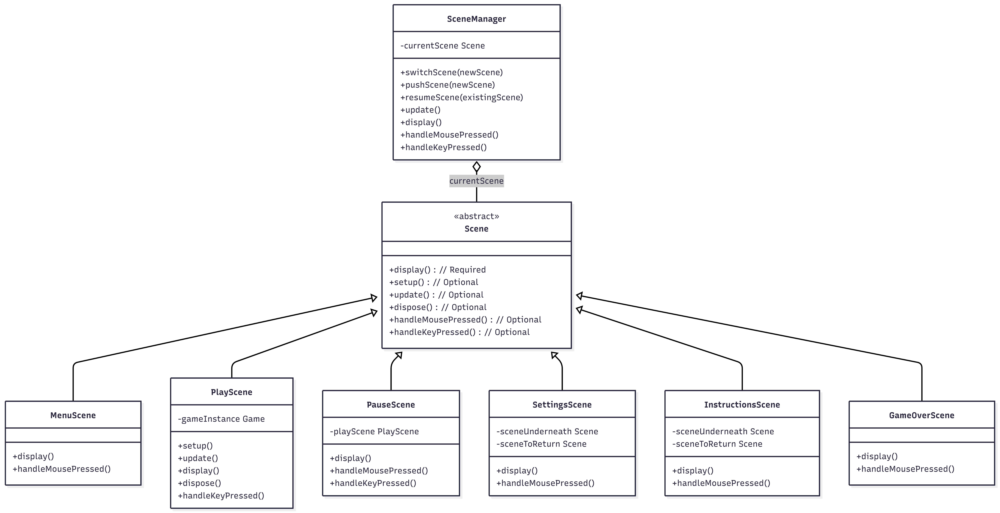

# 5. Implementation

Our implementation of CrateBox is grounded in two key areas of technical challenge that shaped both the architecture and the development process: building a functional Entity–Component–System (ECS) engine from scratch, and ensuring the game maintains consistent visual and physical quality across different screen sizes and zoom levels.

## Challenge 1: Implementing Floating Enemy

One of the most distinctive enemies in CrateBox is the floating enemy, a ghost-like entity that partially ignores gravity and actively hunts the player through the air. Designing its movement behaviour proved to be one of the more difficult implementation challenges: a direct pursuit strategy from the moment of spawn caused enemies to lock onto the player immediately and press straight into walls, where they would become permanently stuck.

**Our Initial Approach**

We initially computed a unit vector from the enemy's position to the player's position every frame and applied an acceleration in that direction. This worked in open space but failed whenever walls got in the way. This also caused enemies to cluster together, without posing any threat to the player. 

**Our Solution**

To address this, we updated the floating enemy’s pathfinding to use two distinct modes based on its distance from the player. When far away, it drifts downward through the level using behaviour similar to other enemies. Once it enters a defined radius, it begins accelerating smoothly toward the player by applying force in the direction of the unit vector between them. This ensures the enemy only actively pursues the player at close range, preventing it from getting stuck on walls. If it moves out of range again, it returns to its natural drifting behaviour.

## Challenge 2: Maintaining Game Quality And Performance

**Animated Background Optimisation**

The game needed to look and feel consistent across different machines, which proved more challenging than expected. While it ran smoothly on some systems, lower-end devices experienced significant frame-rate drops due to the cost of rendering a complex animated background, which required intensive per-pixel calculations.

To address this, we introduced a scaled offscreen rendering approach. The background is first rendered at a reduced resolution and then upscaled to fit the screen. Since rendering cost scales with pixel count, this significantly lowers GPU workload, reducing it to a fraction of the original, while maintaining acceptable visual quality. We also ensured that display scaling did not undo these performance gains, and made the buffer automatically adjust to window size changes to maintain consistent efficiency.

**Consistent Physics Across Framerates**

A second cross-device issue was inconsistent game speed caused by varying frame rates. Because the game updates once per rendered frame, higher refresh rates caused physics to run faster, while lower frame rates slowed everything down. To fix this, we scaled all physics updates using a time factor based on the elapsed time between frames, normalised to a 60 fps baseline. This ensures that movement, gravity, and other physics behaviours progress at a consistent rate, regardless of the hardware or display refresh rate.

**Maintaining Layouts Across Resolutions and Aspect Ratios**

A further issue arose from differences in screen aspect ratios, which caused levels to appear and play differently across devices. To address this, we based all geometry and layout on a fixed 32×18 grid aligned to a 16:9 aspect ratio. This grid was then scaled to the user's screen at runtime (with padding to maintain aspect ratio). This ensured that the relative positioning and proportions of platforms, walls, and entities remained consistent, regardless of screen dimensions. An additional benefit of this approach was that levels could be easily designed and iterated on using simple tools like Excel, before being translated directly into the game.

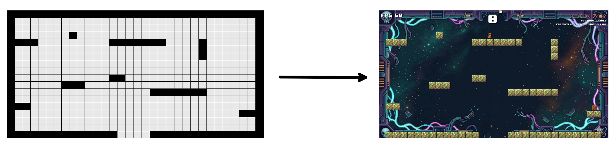


# 6. Evaluation

As part of the development process, the game went through several rounds of evaluation to ensure that the software was meeting the user requirements we had set out to achieve previously. We assessed the game using quantitative and qualitative methods, to give us the clearest picture possible of any potential usability issues whilst minimising the weaknesses that any one method may have.

## Qualitative Evaluation: Think-Aloud
Sixteen participants were gathered in total from workshops. During this evaluation, users were asked to navigate around the map, interact with enemy entities, and pick up crates that spawned around the map. Players were encouraged to express their thoughts as they played. The results are as follows:

**Tasks:**
*   Navigate around the map, jump between platforms
*   Interact with enemy entities- avoid mobs, or kill them
*   Pick up crates as they spawn around the map

<p align="center">
    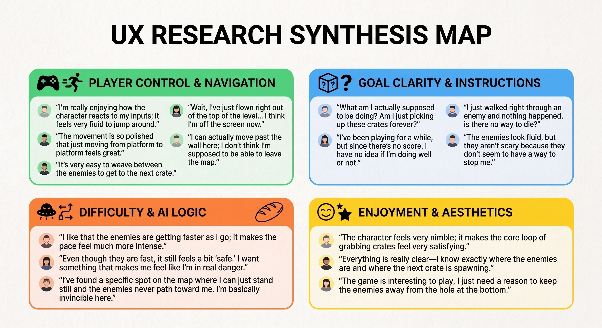
</p>

## Solutions and Adjustments

**Navigation and Map**

*   **Issues:** Users found the movement smooth and enjoyable, however they found that the character could travel outside of the map boundaries.
*   **Solution:** We implemented strict level colliders and invisible walls around the top of the map, so that players could not jump into the hole for the enemy spawn point.

**Game Objectives and Goal clarity**
*   **Issues:** Players were confused about the win conditions. This was brought on by the lack of player death and a score tracker, and led to players not being incentivised to engage with the core mechanics of the game.
*   **Solutions:** A score tracker was added, informing players of how many crates they had collected, and player death was implemented, giving a clear sense of the fail conditions of the game.

**Enemy Pathing and Difficulty**
*   Enemy pathing and the presence of spots in the map where enemies did not cover led to users feeling as though enemies were not dangerous.
*   **Solutions:** We implemented a new type of enemy, the floating enemy, which would intercept the player regardless of map position, and revised the enemy pathing to cover the whole map.

## Heuristic Evaluation
To complement the Think-Aloud method, and to make up for the tendency of its results to be skewed by the social desiribility bias, we also utilised the Heuristic evaluation method as well. Five participants spent approximately half an hour going through the game and its interfaces multiple times, noting down any issues in the game’s usability as according to Nielsen’s 10 Principles of heuristic evaluation. These notes were then compiled and then subsequently worked over.

| Interface Component | Issue | Heuristic(s) | Frequency (0-4) | Impact (0-4) | Persistence (0-4) | Severity (F+I+P)/3 |
| :--- | :--- | :--- | :---: | :---: | :---: | :---: |
| 🔴 UI | Missing score tracking and unclear win/fail conditions | H1: Visibility of system status | 4 | 4 | 4 | 4 |
| 🔴 Level Design | Player can go out of bounds or disappear off the top of the screen | H5: Error prevention | 3 | 4 | 4 | 3.7 |
| 🟡 Enemy Pathing | Enemies don't act as threats or path toward the player; no incentive to stop them | H2: Match between system and real world | 4 | 3 | 4 | 3.7 |
| 🟡 Mechanics | Misalignment between bullet/enemy rendering and actual hitbox positions | H4: Consistency and standards | 2 | 4 | 3 | 3 |
| 🟡 Game Logic | Unfair "safe spots" in enemy pathing where the player cannot be hit | H5: Error prevention | 2 | 3 | 3 | 2.7 |
| 🟢 Combat Feedback | Lack of visual response (flashing/recoil) when enemies are hit | H1: Visibility of system status | 3 | 2 | 2 | 2.3 |
| 🟢 Difficulty | Increase in enemy speed is not immediately intuitive to the player | H1: Visibility of system status | 2 | 2 | 2 | 2 |

Based on the severity scores, we prioritised fixes into three tiers, with 1 being critical, and 3 being minor. 🔴 Tier 1 (Critical) addressed the issues with the UI and the Level Design, as these were preventing users from carrying out the core principles of the game. 🟡 Tier 2 (Major) focused on the Enemy Pathing and Hitboxes, ensuring that the game felt responsive to player inputs. 🟢 Tier 3 (Minor) involved changing the way difficulty and enemy spawn times were implemented, which were addressed only once the first two tiers had been addressed.

## Quantitative Analysis: System Usability Scale (SUS)
To evaluate our game’s improvements, we transitioned from qualitative feedback to empirical, quantitative testing. We specifically measured whether players felt a heightened sense of danger and a clearer understanding of win conditions. Although we conducted tests for different difficulties, we decided on the System Usability Scale (SUS) over the NASA Task Load (TLX) to measure if we had met our objectives. This was because we wanted to ensure player satisfaction and good usability was attained, rather than simply measuring the volume of user workload.

Ten participants were randomly selected to complete SUS evaluations for both “Easy” and “Hard” difficulties. We sought high usability scores to prove that the game is intuitive and to verify our refinements had enhanced the user experience.

| User | Easy Difficulty | Hard Difficulty | Difference (Δ) |
| :--- | :---: | :---: | :---: |
| 1 | 67.5 | 70 | 2.5 |
| 2 | 72.5 | 68.5 | -4 |
| 3 | 62.5 | 65 | 2.5 |
| 4 | 70 | 67 | -3 |
| 5 | 65 | 65 | 0 |
| 6 | 75 | 73 | -2 |
| 7 | 60 | 62.5 | 2.5 |
| 8 | 72.5 | 72.5 | 0 |
| 9 | 67.5 | 66 | -1.5 |
| 10 | 70 | 72.5 | 2.5 |
| **Average** | **68.25** | **68.2** | **-0.05** |


<p align="center">
    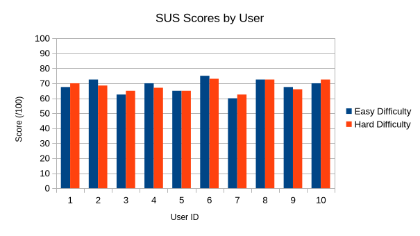
</p>

*Comparison of System Usability Scale (SUS) Scores across Easy and Hard difficulties.*

**Performance Analysis & Interpretation:** The Wilcoxon Signed Rank Test yielded a p-value of 1.0 confirming that the shift in difficulty did not statistically impact usability. With average scores of 68.25 and 68.2 (consistent with the industry average of 68), the data proves that the fixes to collision, boundaries and enemy pathing were effective. The consistency of the scores suggests that difficulty was implemented correctly; the game remained intuitive, and the “Hard” difficulty provided a challenge without causing frustration from encountering bugs. However, these scores do reveal clear room for improvement, with users highlighting the need for enhanced accessibility (customisable controls) and better visual design. Overall, the study clearly shows that the initial issues had been successfully resolved, providing an engaging sense of danger to drive users to pursue the win conditions.

# 7. Process 

## Team Structure & Shared Accountability
At the project's conception, our team adopted a flat structure where all members contributed equally to decision-making while delegating tasks based on individual technical strengths. We divided the development into **Frontend** (animations, environment rendering, and UI) and **Backend** (ECS engine logic, physics, and weapon systems). 

To ensure our development stayed aligned with stakeholder expectations, one team member consistently acted as the **Client/Product Owner**. This role was responsible for validating features against our initial requirements and providing critical feedback during our "live" demonstrations, ensuring the "user's voice" was never lost in the technical implementation.

## Sprint Cadence: Planning & Retrospectives
Our development followed a rigorous weekly agile cadence. We utilized **Tuesday workshop sessions** for **Sprint Planning**, where we brainstormed objectives, estimated task complexity, and assigned Jira tickets. To ensure transparency and iterative growth, we held **Friday Retrospectives** to showcase new features, reflect on the week's blockers, and discuss areas for improvement. This routine allowed us to transition from abstract ideas to technical proof-of-concepts effectively.

| **Sprint Management (Jira)** | **Visual Prototyping (Miro)** |
| :---: | :---: |
|  |  |


During the early stages, we also utilized physical **Paper Prototyping** to validate our mechanics before writing a single line of code. This "low-fidelity" approach was instrumental in deciding to prioritize the "Lights Out" mechanic, which eventually became a core feature of the game.

## Technical Workflow & Quality Control
To maintain high code quality and a clean project history, we implemented a strict Git Flow strategy. Work was strictly isolated in `feature/` or `fix/` branches, requiring at least one peer code review and approval before merging into the main branch. We prioritized a **linear history** through rebasing to keep the integration of complex systems—like the Projectile and Weapon systems—auditable. Furthermore, we standardized our communication using a semantic commit message style (e.g., `feat:`, `fix:`, `chore:`), which allowed the team to track progress at a glance.

| **Commit Standards** | **Git Flow Architecture** |
| :---: | :---: |
|  |  |


## Reflections & Adaptations
While our Agile framework provided a strong foundation, the reality of development presented several challenges that required us to adapt our working style:

**Challenge 1: Task Overlap & Ambiguity**  

**What Didn't Work:** Because we were all navigating game development and p5.js for the first time, initial task boundaries were blurry. Teammates occasionally modified shared files independently, leading to divergent logic and confusion.  

**How We Adapted:** We shifted to a more immediate communication style using our **WhatsApp Group** to flag file modifications in real-time. More importantly, we introduced **pair programming** sessions. This not only prevented overlapping work but also allowed us to share ideas and standardize our coding styles across the frontend and backend boundaries.

**Challenge 2: Feature Creep & Idea Convergence**  

**What Didn't Work:** During brainstorming, our team tended to be overly ambitious. We frequently proposed complex mechanics without knowing if they were technically viable, which stalled early prototyping.  

**How We Adapted:** We implemented a "verify early" rule. Instead of debating complex ideas abstractly, we forced ourselves to either draw a simplified, structural flow on **Miro** or build a bare-bones code proof-of-concept. This grounded our creativity in technical reality.

**Challenge 3: Git Conflicts**  

**What Didn't Work:** Frequent rebasing initially resulted in overwhelming merge conflicts, as isolated tasks ended up interacting with the same core game loops.  

**How We Adapted:** We learned that working in silos is dangerous in game development. When a conflict arose, we stopped resolving them in isolation and immediately initiated quick sync calls with the involved teammates to negotiate the merge. This fundamentally changed our mindset: we learned to constantly read each other's code to anticipate integration points *before* pushing our branches, drastically reducing integration risks later in the project.

# 8. Sustainability

Sustainability was a key consideration throughout our development process, influencing both our design decisions and the themes presented in the game. To ensure a structured approach, we integrated sustainability principles into our workflow using the **Sustainability Awareness Framework**.

## Sustainability Awareness Framework (SusAF)

**Questions and Discussion**
Each team member proposed potential impacts of our game prompted by questions relating to five key sustainability dimensions: social, individual, environmental, economic, and technical. This encouraged us to reflect on our own perspectives and consider different viewpoints, helping us think more critically about sustainability in our project. 

**Analysis**
From these discussions, we developed a set of organised notes that describe the game’s sustainability impacts across the five dimensions.

| Dimension     | Aspect                                | Description                                                  |
| :------------ | :------------------------------------ | :----------------------------------------------------------- |
| Social        | Sense of Community                    | The high score feature provides an opportunity for competitiveness amongst like-minded  people. |
|               | Trust                                 | Our active and consistent development schedule builds trust with users, who can expect new features. |
|               | Inclusiveness and  Diversity          | The game is designed with simple mechanics and minimal narrative barriers, making it  accessible to a wide variety of players regardless of educational background. |
|               | Equity                                | All players have equal access to gameplay features. We implemented no pay-to-win mechanics or locked content to ensure fairness. |
| Individual    | Health                                | The game supports adjustable control schemes, allowing players to choose input methods that minimise strain and improve comfort during extended play sessions. |
|               | Lifelong Learning                     | Players can  develop reflexes, coordination, and strategic thinking through repeated play. |
|               | Privacy                               | The game does not collect any personal data.                 |
|               | Safety                                | Content is designed to be non-realistic and stylised, reducing exposure to harmful or distressing material. |
|               | Agency                                | Players can customise control schemes and choose difficulty levels, giving them control over how they interact with the game. |
| Environmental | Materials and Resources               | The use of  lightweight pixel-art assets and simple animations reduces memory usage and limits the computational resources required to run the game. |
|               | Soil, Atmospheric and Water Pollution | While our game has no direct physical pollution, reducing energy consumption through optimisations indirectly lowers electricity usage. |
|               | Biodiversity and Land Use             | The game’s themed environments (space, cave, ice) are fictional and do not promote harmful real-world land use. |
|               | Energy                                | Efficient asset loading and lightweight graphics reduce CPU and GPU usage, lowering overall energy consumption during gameplay. |
|               | Logistics and Transport               | As a digital-only  product, the game avoids physical distribution, eliminating emissions associated with manufacturing and shipping. |
| Economic      | Value                                 | Potential for paid levels and weapons in future.             |
|               | Customer Relations  Management        | Simple gameplay, high scores, and regular improvements encourage engagement and build a positive relationship with players. |
|               | Supply Chain                          | Uses a minimal, fully digital supply chains, reducing cost, complexity, and reliance on external providers. |
|               | Innovation,  Research and Development | Iterative design of themed levels and adaptable controls supports ongoing improvements, including potential accessibility features like high-contrast mode. |
| Technical     | Maintainability                       | Modular structure separates core systems, making bugs easier to fix and updates easier to implement. |
|               | Usability                             | Simple controls  and clear feedback make the game easy to learn, with customisable inputs  improving accessibility. |
|               | Extensibility and  Adaptability       | New levels, mechanics, and features (e.g. accessibility modes) can be added with minimal changes. |
|               | Security                              | Minimal data collection reduces risk, with no sensitive user information stored. |
|               | Scalability                           | Lightweight design supports additional content and increased usage without major performance impact. |

The insights from this framework were then used to construct a SusAF diagram, which visualises how the impacts of our game extend across the five sustainability dimensions over time. By mapping short, medium, and long-term effects, the diagram highlights how immediate design decisions can lead to broader systemic outcomes. 

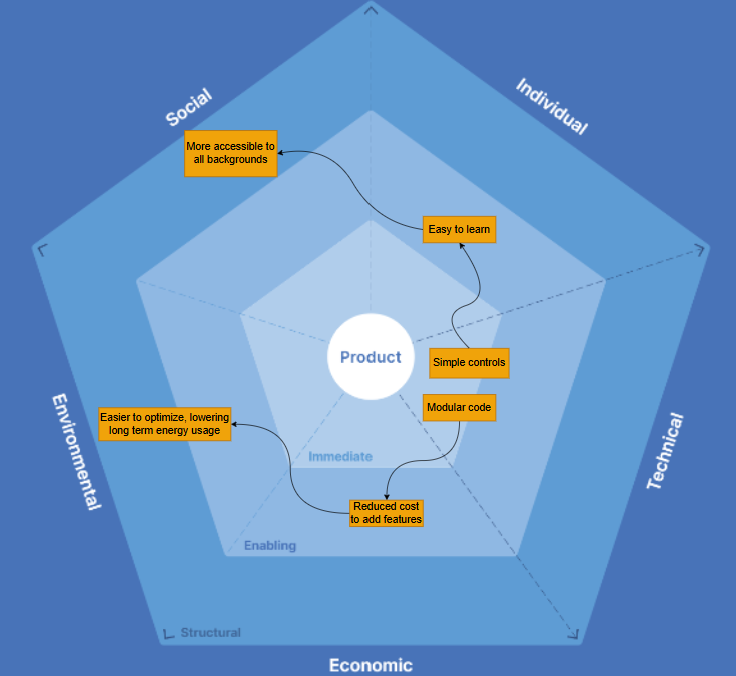

## Sustainability in Design

To embed sustainability considerations into our design, we translated the insights from our earlier analysis into a set of user stories and acceptance criteria. These were again structured across the five sustainability dimensions. The table below shows how the earlier notes were translated into concrete design requirements, which we added to our project backlog.

| Dimension     | User Story                                                   | Acceptance Criterion                                         |
| ------------- | ------------------------------------------------------------ | ------------------------------------------------------------ |
| Social        | As a casual player, I want a fair and balanced game, so that I can enjoy it without feeling disadvantaged. | Given a user is playing, when they progress, then all gameplay features should be equally accessible with no pay-to-win mechanics making the game easier. |
| Social        | As a competitive player, I want to compare my performance with others, so that I feel part of a wider community. | Given a user completes a run, when scores are displayed, then they should be able to view and compare high scores. |
| Individual    | As a player with accessibility needs, I want to customise controls, so that I can play comfortably. | Given a user goes into settings menu, when they change controls, then the new configuration should be applied immediately and persist between screens. |
| Individual    | As a player, I want my privacy to be protected, so that I can play without sharing personal data. | Given a user plays the game, no personal data should be required or stored. |
| Environmental | As a sustainably-minded player, I want the game to run efficiently, so that it uses minimal system resources on my system. | Given a user is playing, when the game is running, then CPU and memory usage should remain low due to optimised assets. |
| Environmental | As a developer, I want to minimise unnecessary resource usage, so that the game has a lower environmental impact. | Given assets are loaded, when they are no longer needed, then they should be removed or reused efficiently. |
| Economic      | As a developer, I want the option to add future content, so that the game can remain financially sustainable. | Given new content is introduced, when additional levels or items are added, then they should integrate without affecting core gameplay balance. |
| Technical     | As a regular player, I want the game to run smoothly over time, so that I can continue playing without performance issues. | Given a user is playing the game, when they play for extended periods, then the game should maintain stable performance without crashes or slowdowns. |
| Technical     | As a developer, I want the game to be easy to update and extend, so that new content can be added without breaking existing features. | Given the system is updated, when new levels or features are added, then existing functionality should remain unaffected. |

## Green Software Design Patterns

To improve the environmental sustainability of our game, we investigated several Green Software Design Patterns and chose three that were most applicable to our system and likely to have meaningful impact. These patterns consider trade-offs across environmental impact, system performance, and cost efficiency. We assessed their potential benefits using the Software Carbon Intensity (SCI) framework, defined as **SCI = (E × I) + M per R**. [1]

Where:

- **E** represents the energy consumed by the system during operation
- **I** represents the carbon intensity of the electricity used
- **M** represents the embodied carbon associated with hardware and infrastructure
- **R** represents the functional unit of software usage being measured (e.g. per game session)

**1. Deprecate GIFs for Animated Content [2]** 

The GIF format has become technically obsolete with the adoption of newer technologies. To reduce the inefficiencies associated with GIF-based animation, we replaced all GIF assets with sprite sheets for in-game animations. In contrast to GIFs, sprite sheets consolidate all animation frames into a single image, which can then be rendered by selectively displaying regions of the sheet.

By storing animation frames in one compact resource, we reduce bandwidth usage and improve rendering efficiency. This lowers processing overhead on the client side, contributing to reduced energy consumption **(E)** .


**2.  Optimising Image Size for Display [3]**

To improve performance and reduce unnecessary resource usage, we optimised all in-game images so that their stored pixel dimensions more closely match their actual display size on the lab machines. Previously, some assets were significantly larger than required and were being scaled down in the browser, which resulted in wasted memory, bandwidth, and processing effort.

Overall, this change reduces energy usage **(E)** by lowering rendering overhead and memory demand, while also minimising wasted storage from oversized assets **(M)**.

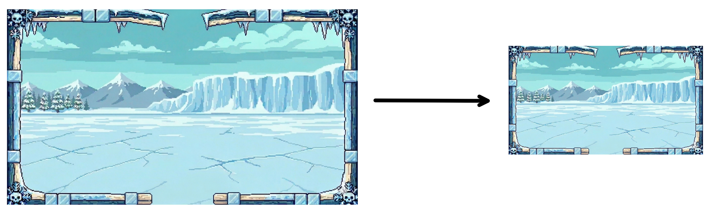

**3. Caching Static Data [4]**

Repeatedly recomputing and redrawing static assets introduces unnecessary CPU work and increases rendering overhead. Even if the underlying data does not change between frames, it may still be re-processed and re-rendered every update cycle, wasting energy. A more efficient approach is to cache the rendered output of static data so it can be reused without re-computation.

We made use of this design pattern in our rendering system. Instead of iterating over wall entities and drawing them each frame, the system pre-renders them once into an off-screen buffer and reuses the resulting image. Pseudocode of this implementation is included below.

```pseudocode
wallCache ← empty

function buildWallCache():
    create offscreen buffer

    for each wall entity:
        get position and size
        render wall tiles into buffer

    store result in wallCache


render loop:
    if wallCache exists:
        draw wallCache to screen
```

Caching static data reduces SCI by lowering repeated computation and rendering. By reusing pre-rendered content instead of recalculating it each frame, less energy is consumed on the client device, reducing energy use **(E)**. It also reduces the amount of work performed across the rendering pipeline over time, which decreases overall hardware utilisation and therefore lowers embodied carbon **(M)**.

# 9. Conclusion

- The CrateBox project has been a massive undertaking. At the early stage, we discussed and set the tone of the whole development process. Instead of using the heavily inherited Object-Oriented-Programming structure, we adopted an unfamiliar design pattern - Entity-Component-System (ECS), which gave us a hard time to learn it in the beginning, but huge development benefits later down the road. Moreover, we implemented change control policies for our Github repo, which meant someone needed to review the code before any pull-request being merged or rebased into the main branch, and had standard formatting for the commit messages. 
These all helped us collaborate more easily and smoothly. 

- Throughout the project, we had regular meetings each week, using Jira to monitor the progress of the project, and Git to preserve the stages of code development. We followed the coding style we had been taught in C and Java - the importance of good code structure, well-designed classes, DRY code, descriptive variable and function names. We refactored the code frequently, which made it more succinct and easy to understand. Many challenges were overcome during the development. From the design of different scenes, to the logic of floating enemies, to maintaining the same game quality when zooming in and out the screen, etc. We grew and sharpened our coding skills along the way, and worked collaboratively through those bottlenecks. 

- For future design of the CrateBox, we would like to integrate some of features we discussed in the beginning, but assessed to be too complex to deliver in the limited timeframes. For instance, the multiplayer feature, which makes the game more interactive, or adding more weapon types like landmine, sword, and grenade, which brings more diversity into the game. Currently, The CrateBox has three types of scenes - cave, iced, and sea, each one has totally different environment settings, we can bring more themes like jungle, or urban into it. We believe those features with some special effects will be able to boost the enjoyment of the game. 

- To conclude, we greatly enjoyed working together to create CrateBox. None of us had prior experience of game development, so the whole journey was more like trial-and-error, but the design decisions we made early on, especially adopting ECS, proved to be the foundation that carried us through. Eventually, we understood a new design pattern, implemented what we had learnt in other courses, and strengthened Git and Github, which integrated the whole knowledge into one project. We are very proud of what we were able to deliver. It's a phenomenal experience.

# 10. Contribution Statement

- Provide a table of everyone's contribution, which *may* be used to weight individual grades. We expect that the contribution will be split evenly across team-members in most cases. Please let us know as soon as possible if there are any issues with teamwork as soon as they are apparent and we will do our best to help your team work harmoniously together.

# 11. References

[1] Green Software Foundation, *Software Carbon Intensity (SCI) Specification*, Green Software Foundation. [Online]. Available: https://sci.greensoftware.foundation/. [Accessed: 26-Apr-2026].

[2] Green Software Foundation, “Deprecate GIFs for animated content,” *Green Software Patterns*, [Online]. Available: [https://patterns.greensoftware.foundation/catalog/web/deprecate-gifs/](https://patterns.greensoftware.foundation/catalog/web/deprecate-gifs/?utm_source=chatgpt.com). [Accessed: 26-Apr-2026].

[3] Green Software Foundation, “Properly sized images,” *Green Software Patterns*, [Online]. Available: [https://patterns.greensoftware.foundation/catalog/web/properly-sized-images/](https://patterns.greensoftware.foundation/catalog/web/properly-sized-images/?utm_source=chatgpt.com). [Accessed: 26-Apr-2026].

[4] Green Software Foundation, “Cache static data,” *Green Software Patterns*, [Online]. Available: [https://patterns.greensoftware.foundation/catalog/cloud/cache-static-data/](https://patterns.greensoftware.foundation/catalog/cloud/cache-static-data/?utm_source=chatgpt.com). [Accessed: 26-Apr-2026].
