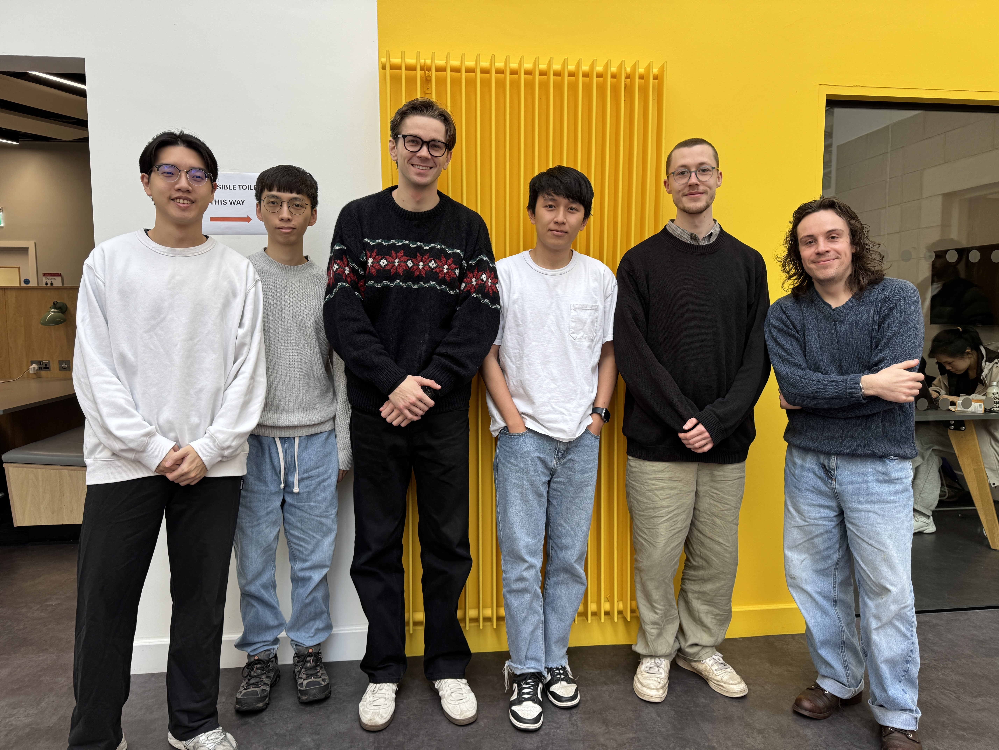
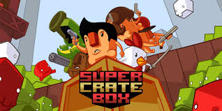
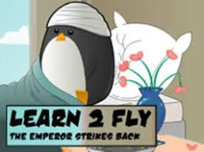
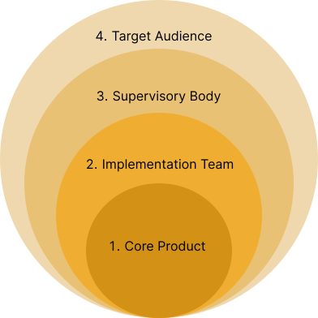
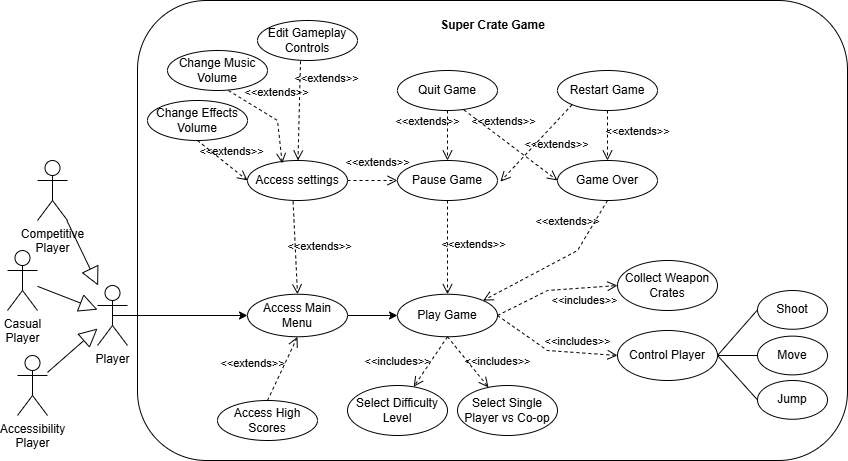
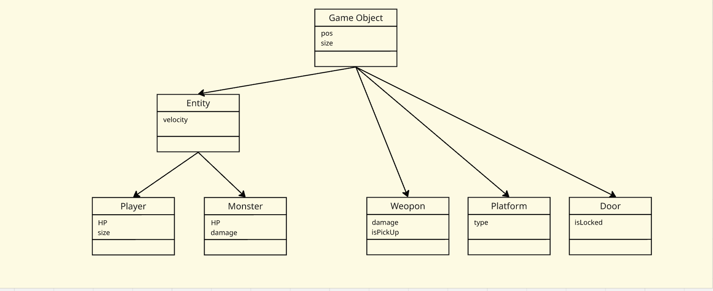
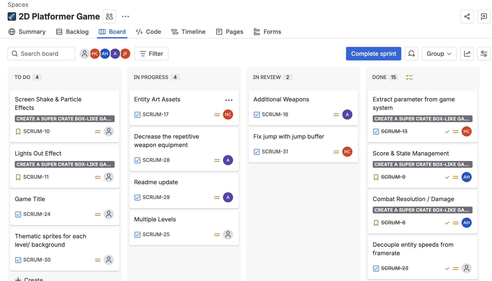
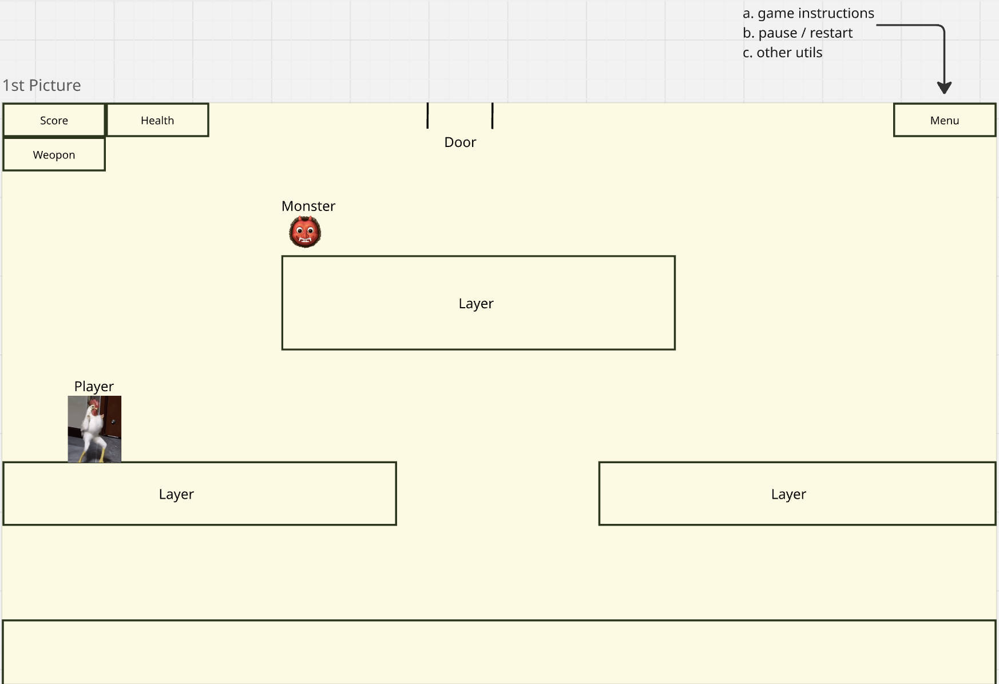
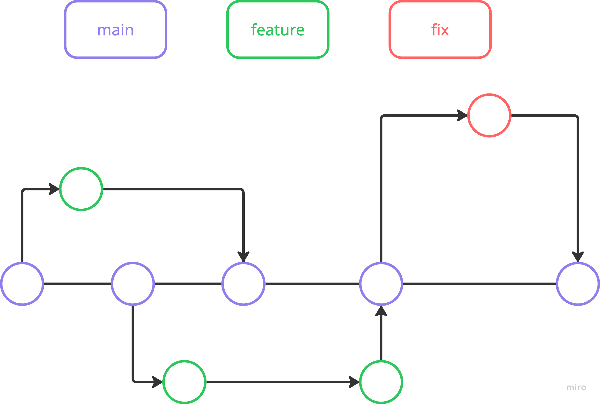
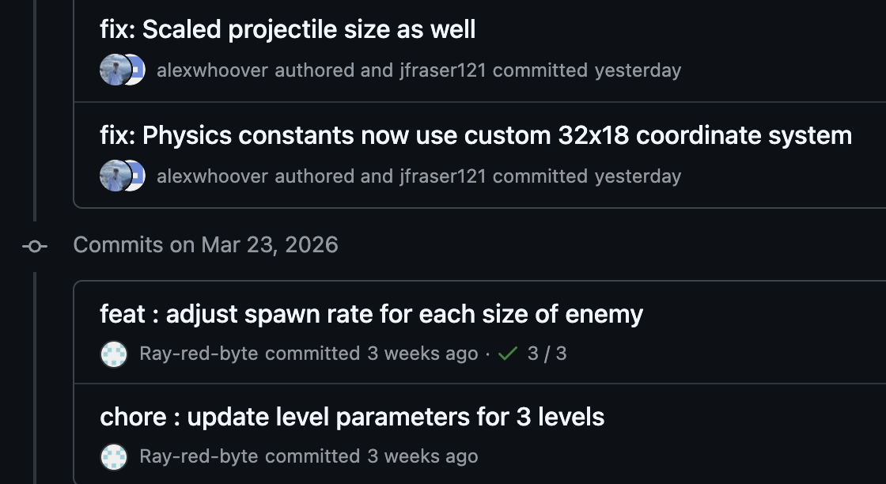

# 2026-group-19
2026 COMSM0166 group 19
Play Our Game!
>>  https://uob-comsm0166.github.io/2026-group-19/  <<

# COMSM0166 Project Template
A project template for the Software Engineering Discipline and Practice module (COMSM0166).

## Info

This is the template for your group project repo/report. We'll be setting up your repo and assigning you to it after the group forming activity. You can delete this info section, but please keep the rest of the repo structure intact.

You will be developing your game using [P5.js](https://p5js.org) a javascript library that provides you will all the tools you need to make your game. However, we won't be teaching you javascript, this is a chance for you and your team to learn a (friendly) new language and framework quickly, something you will almost certainly have to do with your summer project and in future. There is a lot of documentation online, you can start with:

- [P5.js tutorials](https://p5js.org/tutorials/) 
- [Coding Train P5.js](https://thecodingtrain.com/tracks/code-programming-with-p5-js) course - go here for enthusiastic video tutorials from Dan Shiffman (recommended!)

## Your Game (change to title of your game)

STRAPLINE. Add an exciting one sentence description of your game here.

IMAGE. Add an image of your game here, keep this updated with a snapshot of your latest development.

LINK. Add a link here to your deployed game, you can also make the image above link to your game if you wish. Your game lives in the [/docs](/docs) folder, and is published using Github pages. 

VIDEO. Include a demo video of your game here (you don't have to wait until the end, you can insert a work in progress video)

## Your Group



- Alexander Hoover, lv25122@bristol.ac.uk, ROLE
- Jui Cheng Ho, ax25117@bristol.ac.uk, ROLE
- Wei Lun Chang, jb25862@bristol.ac.uk, ROLE
- Chi-Wei Feng, yx25778@bristol.ac.uk, ROLE
- Johnny Fraser, qk18837@bristol.ac.uk, ROLE
- Oliver Parry, nf25715@bristol.ac.uk, ROLE 

## Project Report


### Introduction

- 5% ~250 words 
- Describe your game, what is based on, what makes it novel? (what's the "twist"?)
Our team outlined two main project ideas for potential development. The first game idea was based on the existing game Super Crate Box, and the second is based on the browser game Learn2Fly. Although both of these games are part of different genres, they share similarities in being 2D platformers with side-view perspective, being arcade-like in style and relatively fast-paced for the player.

Game 1: Super Crate Box
Main mechanics:
Fixed map arcade game, where the player controls a character equipped with weapons.
Scoring system is defined by picking up crates, which spawn randomly and periodically around the map. Picking up crates results in a counter incrementing, and being ultimately stored in a leaderboard.
Crates also contain a random weapon within, with weapons having their own unique attributes to fight against enemies.
Enemies spawn in through the top of the map, progress over platforms within the map, and if they collide with the player, the game ends.
Enemies differ in size between 'normal' sized enemies, which are smaller in hitbox and take 1 hit, and 'big' enemies, which are larger but take multiple hits to kill.
If enemies reach the bottom of the map, and fall through a gate at the bottom, they re-appear at the top again, only much faster in movement.
The music is retro/arcade, adding to the fast-paced nature of the game, and evoking a sense of nostalgia to older games of a similar genre.

Key strengths:
The core game mechanics are relatively simple, so there won't be the case of biting off more than we can chew. Moreover, we can implement the main features, and then work on adding our own twists to the game, iterating and further polishing as we go so that a seamless experience is achieved. The game is not so reliant on the quality of the graphics, so although we will all gain some experience creating our own visual entities, the quality of the graphics won't weigh down the implementation of other more important aspects of the game. This way development can continue to be refined simultaneous to the development of better graphics if need be.

Possible Twists:
Main twists would be changes to the environment in which the map is played. Adding wind which would affect bullet trajectory and physics as well as potentially the player would be interesting, which would occur at random points within the game for a specified amount of time. Similarly, limiting the perspective that the player can see from, for example removing lighting would be another interesting mechanic. In this way, the entire map would no longer be able to be seen in its entirety as usual, and instead the player is limited to seeing based on proximity from their player entity and which way they are facing. Changing gravity conditions is also a good twist, where the entire map flips, and the player has to traverse the map upside-down, with the enemies moving in the opposite direction.

### Requirements 
The first stage of our development process was to identify what type of game we wanted to make. To do this, we chose two games as inspiration: Super Crate Box and Learn 2 Fly.

#### Idea Development
|  |  |
|---|---|
| **Super Crate Box**<br>Fast-paced arcade platform shooter | **Learn 2 Fly 2**<br>Physics-based launch/upgrade game |

We began by brainstorming potential game genres to ensure our team shared a clear and unified vision for the type of game we wanted to create. Each team member then ranked their preferred genres, and Arcade-style and Platformer emerged as the clear favourites. With this focus established, we explored specific game ideas within these genres and ultimately selected Super Crate Box and Learn 2 Fly as our primary sources of inspiration. 

We created paper prototypes for both game concepts and tested them with classmates to evaluate the user experience. Based on their feedback, users preferred the Super Crate Box–inspired version, noting that it had clearer objectives and more intuitive game mechanics. Our group was also more motivated to pursue this direction, as the Super Crate Box concept offered greater potential for expansion beyond the original, such as introducing new enemies, items, and additional gameplay features.

With the core gameplay inspiration established, we began identifying the key elements we wanted our game to inherit, as well as areas where we could expand and introduce new ideas. Several features stood out to us from the original game. In particular, the variety of weapon types helped ensure that each playthrough felt fresh and dynamic, while the mechanic of enemies becoming more powerful upon reaching the bottom added tension and encouraged players to act quickly. We also appreciated the smooth animations and camera shake effects, which made the gameplay feel responsive and impactful.

At the same time, we explored ways to extend and innovate on the original concept. One idea was to increase the difficulty and atmosphere by having the lights turn off partway through the game, limiting the player’s visibility to a small radius illuminated by a headlamp. We also considered introducing a jetpack obtained from crates, allowing the player greater mobility and vertical freedom. Additionally, we discussed expanding the combat system to include hand-to-hand or melee weapons alongside firearms, adding further variety and strategic options for the player.


- 15% ~750 words
- Early stages design. Ideation process. How did you decide as a team what to develop? Use case diagrams, user stories.

### Stakeholders:

### 1. Core Product
The central software artifact being developed.  
It represents the primary value delivered to users and the focus of all technical and design decisions.

### 2. Implementation Team
The developers and designers responsible for building, testing, and maintaining the product.  
They translate requirements into a working system.

### 3. Supervisory Body
Professors, experts, or sponsors providing oversight and governance.  
They ensure academic, technical, and strategic alignment.

### 4. Target Audience
The end users of the product, such as casual and competitive gamers.  
Their needs, behaviours, and feedback shape the product’s evolution.

Stakeholders

Core: The game

Containing System - people benefitting from the system's results, primary users interacting with game

Support and Maintenance - technical staff keeping the game running and updated
Group 19
Student Volunteers & Game Testers

Direct Users:
Younger players
Competitive players
Casual Players
Sensitive hearing users
Visually impaired

Immediate Beneficiaries:
Unit lecturers and academic supervisors

Academic Context:
Computer Science course MSc


Wider Environment - stakeholders not touching the software but influence its requirements and are affected by it.
Sponsors and purchasers, regulators, the public, negative stakeholders

External Influences from Tools used:
p5.js (potential maintenance operator: handling hosting of code)
Github (hosting and saving of repo)
Web Browsers = Interfacing Systems

Regulators:
Games Rating Authority
University of Bristol
GDPR Advisors

Indirect Stakeholders:
Negative Stakeholders
Wider Public


EPICS:
 - as a competititive player i want to see my score and know my old high score so that i can see if i am improving at the game (competetive players)
 - as a casual gamer i would like to be able to unlock new weapons and things to progress in the game other than score, maybe from a shop screen with collectible coins (casual users)
 - as a casual gamer i want clear instrustions on how to play and options for difficulty levels so that the game isn't too hard (casual users)
 - as a user with sensitive hearing i would like to be able to control the volume of in-game sounds and music independently
 - as a user with 



### Design

- 15% ~750 words 
- System architecture. Class diagrams, behavioural diagrams. 


With a set of preliminary requirements established for our game, we next turned to designing its architecture. During the 2026 BrisHack hackathon, our team experimented with a traditional object-oriented design using deep inheritance hierarchies. In this approach, a typical class structure might resemble:

```
GameObject → MovingEntity → Character → Player
```

While this design works adequately for small projects, we found that it did not scale well. Managing deep inheritance trees quickly became difficult, and the structure made it harder to reason about the relationships between classes. Additionally, we encountered the “God Class” problem, where individual classes accumulated large amounts of logic within a single file, making the code harder to maintain and extend.
For the development of our actual game, we therefore sought a design pattern that minimized inheritance, separated entity behaviour from the entities themselves, and remained conceptually simple. Based on these goals, we chose to implement an Entity–Component–System (ECS) architecture for the backend of our game. Unlike the traditional object-oriented approach, where objects encapsulate both data and behaviour, ECS separates the game into three distinct and loosely coupled parts.

- <strong>Entities:</strong>
An entity is simply a unique integer identifier. By itself, an entity contains no data or behaviour.

- <strong>Components:</strong>
Components store data but contain no logic. For example, a position component may store an entity’s x and y coordinates. Components are typically represented as lightweight structures.

- <strong>Systems:</strong>
Systems contain the game’s logic. Each system queries the ECS “database” for entities that possess a specific combination of components, then applies the relevant behaviour to those entities.

This architecture also provides several additional benefits. The ECS database can be organized so that components are stored contiguously in memory, improving cache locality and overall performance. Achieving this level of memory efficiency is far more difficult with traditional object-oriented designs. Furthermore, ECS makes it easy to add new functionality. Rather than modifying existing class hierarchies, new behaviour can be introduced by defining a new component and system, then attaching the component to relevant entities. This modular structure enables rapid development of new features without requiring significant refactoring of existing code.

### Implementation

- 15% ~750 words

- Describe implementation of your game, in particular highlighting the TWO areas of *technical challenge* in developing your game. 

### Evaluation

- 15% ~750 words

- One qualitative evaluation (of your choice)

Think-Aloud User Evaluation chosen:
During the devlopment process, we employed an iterative design, whereby user testing consistently used to ensure our aims for the final product were well-met and intuitive. During this testing process, users were asked to verbalise their thought processes and opinions of the gaming experience.

For our first think-aloud evaluation, our main objectives were to ensure controls were intuitive and that the movement of the character and enemies were fluid and felt controllable.
The user testing results were as follows:

-User Controls: Players did not have an issue with the placement of the keys, nor was there an issue with the choice of the arrow keys to control movement, these were picked up quickly and easily by all users.
-Entity Movement: Users enjoyed the movement of the character; they felt that they were in control, and could easily traverse the platforms within the game. Any difficulty with speed and gravity was overcome easily with familiarity to the game. Enemy entities were smooth and the slow increase in enemy speed as the game progressed was seen positively as a way to increase difficulty. However, there were parts of the map where the enemies would not path/spawn to, therefore the player could stand there without fear of being hit.

Key Issues Identified:
-At higher speeds, collisions between character projectiles and enemy entities were not always accurate, and would not result in proper collision detection.
-Without player health, collision detection between enemy and player entities, and a score counter, there was little to indicate what the objective of the game was. There is no incentive for the player to shoot or to try to prevent the enemies from reaching the bottom of the map, since the player was unkillable and there was no change in the enemies after having reached th bottom either. There was also no score tracker, so no way of giving an idea of the underlying goal of staying alive and killing enemies.
-An area was identified whereby the player could jump outside of the map and outside of view.

- One quantitative evaluation (of your choice) 

- Description of how code was tested. 

### Process 

#### Team Roles & Division of Labor
To manage the complexity of building a game in p5.js from scratch, we divided our team into two primary domains: **Frontend** and **Backend**. 
* **Frontend:** Focused on the visual layer, including character animations, environment rendering (backgrounds and platforms), and UI elements.
* **Backend:** Handled the game logic and mathematical constraints, including character and enemy movement physics, collision detection, and weapon shooting mechanisms.

#### Methodology & Collaborative Tools
* **Agile Development:** We employed Agile methodologies to keep our iterative development organized. Using **Jira**, we maintained a **Kanban** board and managed our sprints. During our weekly Tuesday planning sessions, we brainstormed objectives and created Jira tickets. To prevent task overlap, team members estimated time limits for their assigned cards, helping us gauge the complexity of each sprint. We also used **Google Docs** to document sprint goals, ensuring the entire team remained aligned on individual responsibilities.
    
    

* **Visual Prototyping:** For the frontend design, we utilized **Miro** as a collaborative whiteboard. This allowed all team members, regardless of their technical role, to sketch out visual concepts and iterate on UI/UX ideas freely during discussions.

    

#### Technical Workflow
To maintain a high standard of code quality and a clean project history, we implemented a rigorous version control strategy:
* **Git Flow:** Work was strictly assigned via dedicated `feature/` branches. We also utilized `fix/` branches to address bugs discovered after a feature had been merged.
* **Commit Message Style:** We defined a standardized commit message style to maintain a clear, readable, and highly organized version history. By categorizing our updates with semantic prefixes such as `feat:` (for new features), `fix:` (for bug resolutions), and `chore:` (for maintenance or configuration updates), team members could instantly understand the purpose of a change at a glance. This practice significantly streamlined our code reviews and made tracking down specific updates during debugging much easier.
* **Linear History:** We prioritized rebasing over merging to ensure our Git history remained linear. This made it much easier to audit and track changes as complex modular systems (like the `ProjectileSystem` and `WeaponSystem`) were integrated.
    
    
    

* **Code Review:** Every Pull Request required at least one approval from a teammate before merging into the main branch. This ensured that everyone stayed informed about recent updates and could provide feedback on core components like the `EntityFactory`. We also utilized **GitHub Copilot** as an AI assistant to help identify edge cases during code reviews.

#### Reflections & Adaptations
While our Agile framework provided a strong foundation, the reality of development presented several challenges that required us to adapt our working style:

* **Challenge: Task Overlap & Ambiguity**
    * **What Didn't Work:** Because we were all navigating game development and p5.js for the first time, initial task boundaries were blurry. Teammates occasionally modified shared files independently, leading to divergent logic and confusion.
    * **How We Adapted:** We shifted to a more immediate communication style using our **WhatsApp Group** to flag file modifications in real-time. More importantly, we introduced **pair programming** sessions. This not only prevented overlapping work but also allowed us to share ideas and standardize our coding styles across the frontend and backend boundaries.

* **Challenge: Feature Creep & Idea Convergence**
    * **What Didn't Work:** During brainstorming, our team tended to be overly ambitious. We frequently proposed complex mechanics without knowing if they were technically viable, which stalled early prototyping.
    * **How We Adapted:** We implemented a "verify early" rule. Instead of debating complex ideas abstractly, we forced ourselves to either draw a simplified, structural flow on **Miro** or build a bare-bones code proof-of-concept. This grounded our creativity in technical reality.

* **Challenge: Git Conflicts**
    * **What Didn't Work:** Frequent rebasing initially resulted in overwhelming merge conflicts, as isolated tasks ended up interacting with the same core game loops. 
    * **How We Adapted:** We learned that working in silos is dangerous in game development. When a conflict arose, we stopped resolving them in isolation and immediately initiated quick sync calls with the involved teammates to negotiate the merge. This fundamentally changed our mindset: we learned to constantly read each other's code to anticipate integration points *before* pushing our branches, drastically reducing integration risks later in the project.

### Conclusion

- 10% ~500 words

- Reflect on the project as a whole. Lessons learnt. Reflect on challenges. Future work, describe both immediate next steps for your current game and also what you would potentially do if you had chance to develop a sequel.

### Contribution Statement

- Provide a table of everyone's contribution, which *may* be used to weight individual grades. We expect that the contribution will be split evenly across team-members in most cases. Please let us know as soon as possible if there are any issues with teamwork as soon as they are apparent and we will do our best to help your team work harmoniously together.

### Additional Marks

You can delete this section in your own repo, it's just here for information. in addition to the marks above, we will be marking you on the following two points:

- **Quality** of report writing, presentation, use of figures and visual material (5% of report grade) 
  - Please write in a clear concise manner suitable for an interested layperson. Write as if this repo was publicly available.
- **Documentation** of code (5% of report grade)
  - Organise your code so that it could easily be picked up by another team in the future and developed further.
  - Is your repo clearly organised? Is code well commented throughout?
