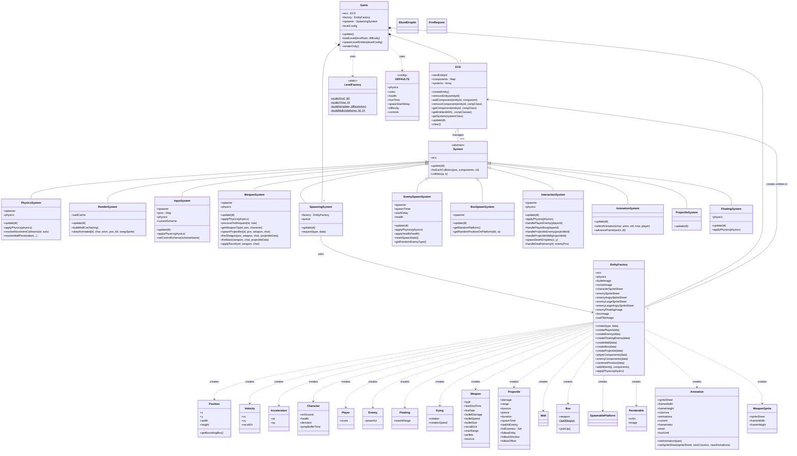

```mermaid
classDiagram
    %% ─────────────────────────────────────────────
    %% ECS CORE
    %% ─────────────────────────────────────────────
    class ECS {
        +nextEntityId
        +components : Map
        +systems : Array
        +createEntity()
        +removeEntity(entityId)
        +addComponent(entityId, component)
        +removeComponent(entityId, compClass)
        +getComponent(entityId, compClass)
        +getEntitiesWith(...compClasses)
        +getSystem(systemClass)
        +update(dt)
        +clear()
    }

    class System {
        <<abstract>>
        +ecs
        +update(dt)*
        +forEachCollision(pos, components, cb)
        +collides(a, b)
    }

    ECS "1" o-- "many" System : manages

    %% ─────────────────────────────────────────────
    %% SYSTEMS
    %% ─────────────────────────────────────────────
    class PhysicsSystem {
        +spawner
        +physics
        +update(dt)
        +applyPhysics(physics)
        +resolveMovementCollisions(id, axis)
        +resolveWallPenetration(...)
    }
    class RenderSystem {
        +wallCache
        +update(dt)
        +buildWallCache(img)
        +drawAnimated(id, char, anim, pos, bb, weapSprite)
    }
    class InputSystem {
        +spawner
        +prev : Map
        +physics
        +currentScheme
        +update(dt)
        +applyPhysics(physics)
        +setControlScheme(schemeName)
    }
    class WeaponSystem {
        +spawner
        +physics
        +update(dt)
        +applyPhysics(physics)
        +processFireRequest(id, now)
        +getWeaponTip(id, pos, character)
        +spawnProjectiles(id, pos, weapon, char)
        +fireShotgun(pos, weapon, char, projectileData)
        +fireBasic(weapon, char, projectileData)
        +applyRecoil(vel, weapon, char)
    }
    class SpawningSystem {
        +factory : EntityFactory
        +queue
        +update(dt)
        +request(type, data)
    }
    class EnemySpawnSystem {
        +spawner
        +spawnTimer
        +startDelay
        +health
        +update(dt)
        +applyPhysics(physics)
        +applyHealth(health)
        +resetSpawnState()
        +getRandomEnemyType()
    }
    class BoxSpawnSystem {
        +spawner
        +update(dt)
        +getRandomPlatform()
        +getRandomPositionOnPlatform(bb, w)
    }
    class InteractionSystem {
        +spawner
        +physics
        +update(dt)
        +applyPhysics(physics)
        +handlePlayerEnemy(playerId)
        +handlePlayerBox(playerId)
        +handleProjectileEnemy(projectileId)
        +handleProjectileWall(projectileId)
        +spawnDeathDroplets(x, y)
        +handleDeath(enemyId, enemyPos)
    }
    class AnimationSystem {
        +update(dt)
        +selectAnimation(char, anim, vel, now, player)
        +advanceFrame(anim, dt)
    }
    class ProjectileSystem {
        +update(dt)
    }
    class FloatingSystem {
        +physics
        +update(dt)
        +applyPhysics(physics)
    }

    System <|-- PhysicsSystem
    System <|-- RenderSystem
    System <|-- InputSystem
    System <|-- WeaponSystem
    System <|-- SpawningSystem
    System <|-- EnemySpawnSystem
    System <|-- BoxSpawnSystem
    System <|-- InteractionSystem
    System <|-- AnimationSystem
    System <|-- ProjectileSystem
    System <|-- FloatingSystem

    SpawningSystem --> EntityFactory : uses

    %% ─────────────────────────────────────────────
    %% ENTITY FACTORY
    %% ─────────────────────────────────────────────
    class EntityFactory {
        +ecs
        +physics
        +bulletImage
        +rocketImage
        +characterSpriteSheet
        +enemySpriteSheet
        +enemyAngrySpriteSheet
        +enemyLargeSpriteSheet
        +enemyLargeAngrySpriteSheet
        +enemyFloatingImage
        +boxImage
        +wallTileImage
        +create(type, data)
        +createPlayer(data)
        +createEnemy(data)
        +createFloatingEnemy(data)
        +createWall(data)
        +createBox(data)
        +createProjectile(data)
        +playerComponents(data)
        +enemyComponents(data)
        +centeredPosition(data)
        +addAll(entity, components)
        +applyPhysics(physics)
    }

    EntityFactory --> ECS : creates entities in

    %% ─────────────────────────────────────────────
    %% GAME COORDINATOR
    %% ─────────────────────────────────────────────
    class Game {
        +ecs : ECS
        +factory : EntityFactory
        +spawner : SpawningSystem
        +levelConfig
        +update()
        +loadLevel(levelNum, difficulty)
        +spawnLevelEntities(levelConfig)
        +renderOnly()
    }

    Game "1" *-- "1" ECS
    Game "1" *-- "1" EntityFactory
    Game "1" *-- "1" SpawningSystem

    %% ─────────────────────────────────────────────
    %% COMPONENTS — Physics
    %% ─────────────────────────────────────────────
    class Position {
        +x
        +y
        +width
        +height
        +getBoundingBox()
    }
    class Velocity {
        +vx
        +vy
        +recoilVx
    }
    class Acceleration {
        +ax
        +ay
    }

    %% ─────────────────────────────────────────────
    %% COMPONENTS — Character / Entity
    %% ─────────────────────────────────────────────
    class Character {
        +onGround
        +health
        +direction
        +jumpBufferTime
    }
    class Player {
        +score
    }
    class Enemy {
        +powerful
    }
    class Floating {
        +wasInRange
    }
    class Dying {
        +rotation
        +rotationSpeed
    }
    class BloodDroplet
    class FireRequest

    %% ─────────────────────────────────────────────
    %% COMPONENTS — Combat
    %% ─────────────────────────────────────────────
    class Weapon {
        +type
        +lastShotTime
        +fireRate
        +bulletDamage
        +bulletSpeed
        +bulletSize
        +recoilKick
        +maxRange
        +pellets
        +bounce
    }
    class Projectile {
        +damage
        +range
        +bounce
        +pierce
        +duration
        +spawnTime
        +lastHitEnemy
        +hitEnemies : Set
        +followEntity
        +followDirection
        +followOffset
    }

    %% ─────────────────────────────────────────────
    %% COMPONENTS — Environment
    %% ─────────────────────────────────────────────
    class Wall
    class Box {
        +weapon
        +lastWeapon$
        +pickUp()
    }
    class SpawnablePlatform

    %% ─────────────────────────────────────────────
    %% COMPONENTS — Rendering
    %% ─────────────────────────────────────────────
    class WeaponSprite {
        +spriteSheet
        +frameWidth
        +frameHeight
    }
    class Renderable {
        +color
        +image
    }
    class Animation {
        +spriteSheet
        +frameWidth
        +frameHeight
        +columns
        +animations
        +current
        +frameIndex
        +timer
        +hurtUntil
        +setAnimation(type)
        +setSpriteSheet(spriteSheet, newColumns, newAnimations)
    }

    %% Factory creates component compositions
    EntityFactory ..> Position : creates
    EntityFactory ..> Velocity : creates
    EntityFactory ..> Acceleration : creates
    EntityFactory ..> Character : creates
    EntityFactory ..> Player : creates
    EntityFactory ..> Enemy : creates
    EntityFactory ..> Floating : creates
    EntityFactory ..> Dying : creates
    EntityFactory ..> Weapon : creates
    EntityFactory ..> Projectile : creates
    EntityFactory ..> Wall : creates
    EntityFactory ..> Box : creates
    EntityFactory ..> SpawnablePlatform : creates
    EntityFactory ..> Renderable : creates
    EntityFactory ..> Animation : creates
    EntityFactory ..> WeaponSprite : creates

    %% ─────────────────────────────────────────────
    %% CONFIGURATION
    %% ─────────────────────────────────────────────
    class LevelFactory {
        <<static>>
        +scaleX(col, W)$
        +scaleY(row, H)$
        +build(template, difficultyKey)$
        +buildWalls(platforms, W, H)$
    }
    class DEFAULTS {
        <<config>>
        +physics
        +sizes
        +health
        +hurtTime
        +spawnStartDelay
        +difficulty
        +controls
    }

    Game ..> LevelFactory : uses
    Game ..> DEFAULTS : uses
```
