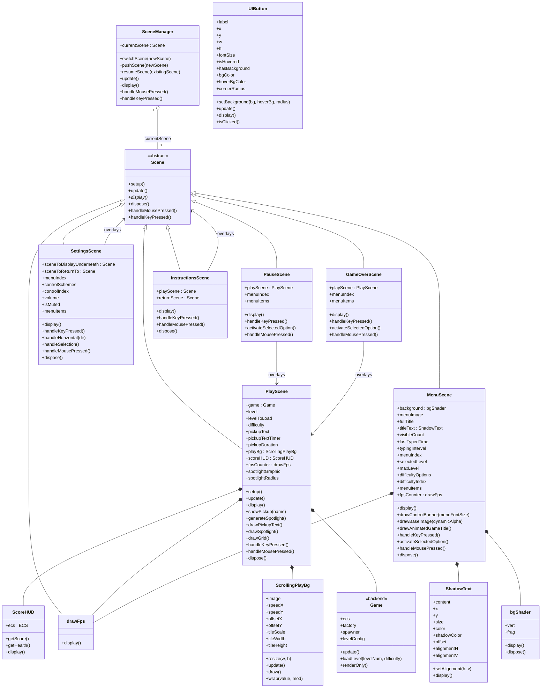

```mermaid
classDiagram
    %% ─────────────────────────────────────────────
    %% SCENE MANAGEMENT
    %% ─────────────────────────────────────────────
    class Scene {
        <<abstract>>
        +setup()
        +update()
        +display()*
        +dispose()
        +handleMousePressed()
        +handleKeyPressed()
    }

    class SceneManager {
        +currentScene : Scene
        +switchScene(newScene)
        +pushScene(newScene)
        +resumeScene(existingScene)
        +update()
        +display()
        +handleMousePressed()
        +handleKeyPressed()
    }

    SceneManager "1" o-- "1" Scene : currentScene

    %% ─────────────────────────────────────────────
    %% CONCRETE SCENES
    %% ─────────────────────────────────────────────
    class PlayScene {
        +game : Game
        +level
        +levelToLoad
        +difficulty
        +pickupText
        +pickupTextTimer
        +pickupDuration
        +playBg : ScrollingPlayBg
        +scoreHUD : ScoreHUD
        +fpsCounter : drawFps
        +spotlightGraphic
        +spotlightRadius
        +setup()
        +update()
        +display()
        +showPickup(name)
        +generateSpotlight()
        +drawPickupText()
        +drawSpotlight()
        +drawGrid()
        +handleKeyPressed()
        +handleMousePressed()
        +dispose()
    }
    class MenuScene {
        +background : bgShader
        +menuImage
        +fullTitle
        +titleText : ShadowText
        +visibleCount
        +lastTypedTime
        +typingInterval
        +menuIndex
        +selectedLevel
        +maxLevel
        +difficultyOptions
        +difficultyIndex
        +menuItems
        +fpsCounter : drawFps
        +display()
        +drawControlBanner(menuFontSize)
        +drawBaseImage(dynamicAlpha)
        +drawAnimatedGameTitle()
        +handleKeyPressed()
        +activateSelectedOption()
        +handleMousePressed()
        +dispose()
    }
    class PauseScene {
        +playScene : PlayScene
        +menuIndex
        +menuItems
        +display()
        +handleKeyPressed()
        +activateSelectedOption()
        +handleMousePressed()
    }
    class SettingsScene {
        +sceneToDisplayUnderneath : Scene
        +sceneToReturnTo : Scene
        +menuIndex
        +controlSchemes
        +controlIndex
        +volume
        +isMuted
        +menuItems
        +display()
        +handleKeyPressed()
        +handleHorizontal(dir)
        +handleSelection()
        +handleMousePressed()
        +dispose()
    }
    class GameOverScene {
        +playScene : PlayScene
        +menuIndex
        +menuItems
        +display()
        +handleKeyPressed()
        +activateSelectedOption()
        +handleMousePressed()
    }
    class InstructionsScene {
        +playScene : Scene
        +returnScene : Scene
        +display()
        +handleKeyPressed()
        +handleMousePressed()
        +dispose()
    }
    class drawFps {
        +display()
    }

    Scene <|-- PlayScene
    Scene <|-- MenuScene
    Scene <|-- PauseScene
    Scene <|-- SettingsScene
    Scene <|-- GameOverScene
    Scene <|-- InstructionsScene
    Scene <|-- drawFps

    PlayScene *-- ScoreHUD
    PlayScene *-- drawFps
    PlayScene *-- ScrollingPlayBg
    MenuScene *-- ShadowText
    MenuScene *-- drawFps
    MenuScene *-- bgShader
    PauseScene --> PlayScene : overlays
    SettingsScene --> Scene : overlays
    GameOverScene --> PlayScene : overlays
    InstructionsScene --> Scene : overlays

    %% ─────────────────────────────────────────────
    %% UI UTILITIES
    %% ─────────────────────────────────────────────
    class ShadowText {
        +content
        +x
        +y
        +size
        +color
        +shadowColor
        +offset
        +alignmentH
        +alignmentV
        +setAlignment(h, v)
        +display()
    }
    class UIButton {
        +label
        +x
        +y
        +w
        +h
        +fontSize
        +isHovered
        +hasBackground
        +bgColor
        +hoverBgColor
        +cornerRadius
        +setBackground(bg, hoverBg, radius)
        +update()
        +display()
        +isClicked()
    }
    class ScoreHUD {
        +ecs : ECS
        +getScore()
        +getHealth()
        +display()
    }
    class bgShader {
        +vert
        +frag
        +display()
        +dispose()
    }
    class ScrollingPlayBg {
        +image
        +speedX
        +speedY
        +offsetX
        +offsetY
        +tileScale
        +tileWidth
        +tileHeight
        +resize(w, h)
        +update()
        +draw()
        +wrap(value, mod)
    }

    %% PlayScene owns the Game backend coordinator
    class Game {
        <<backend>>
        +ecs
        +factory
        +spawner
        +levelConfig
        +update()
        +loadLevel(levelNum, difficulty)
        +renderOnly()
    }

    PlayScene *-- Game
```
