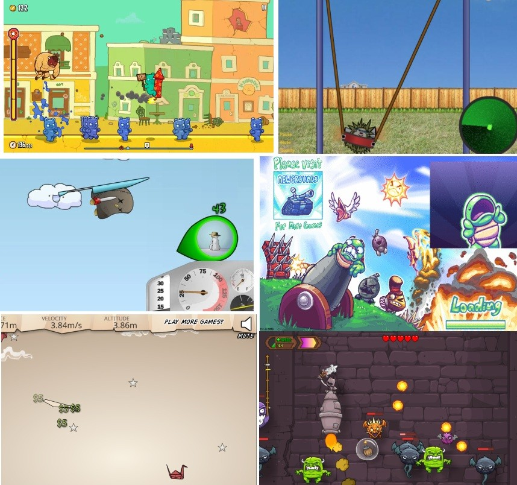
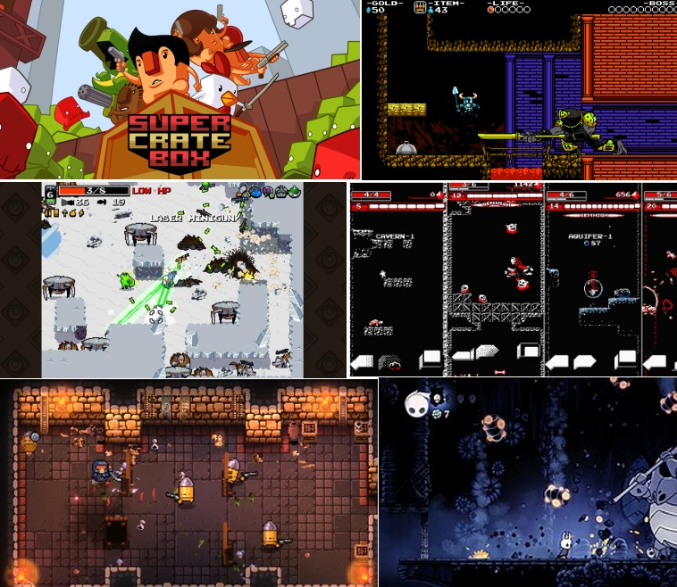
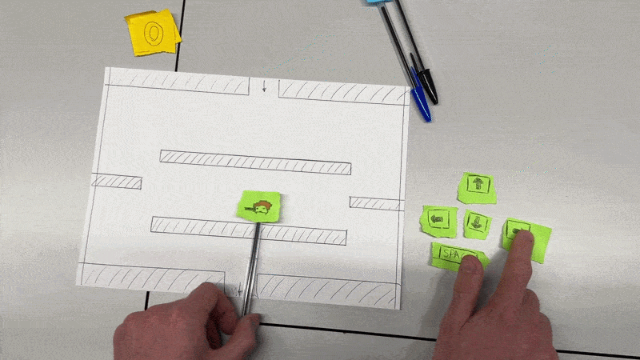
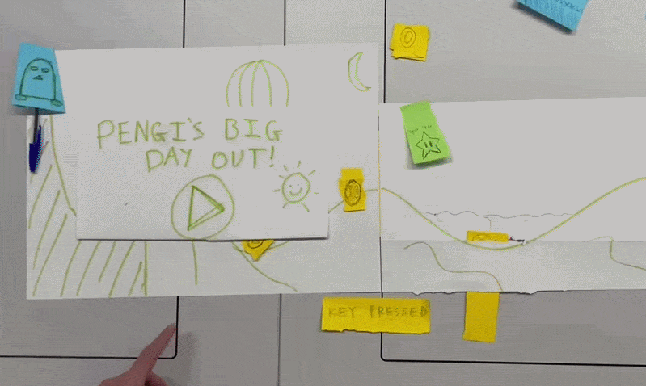
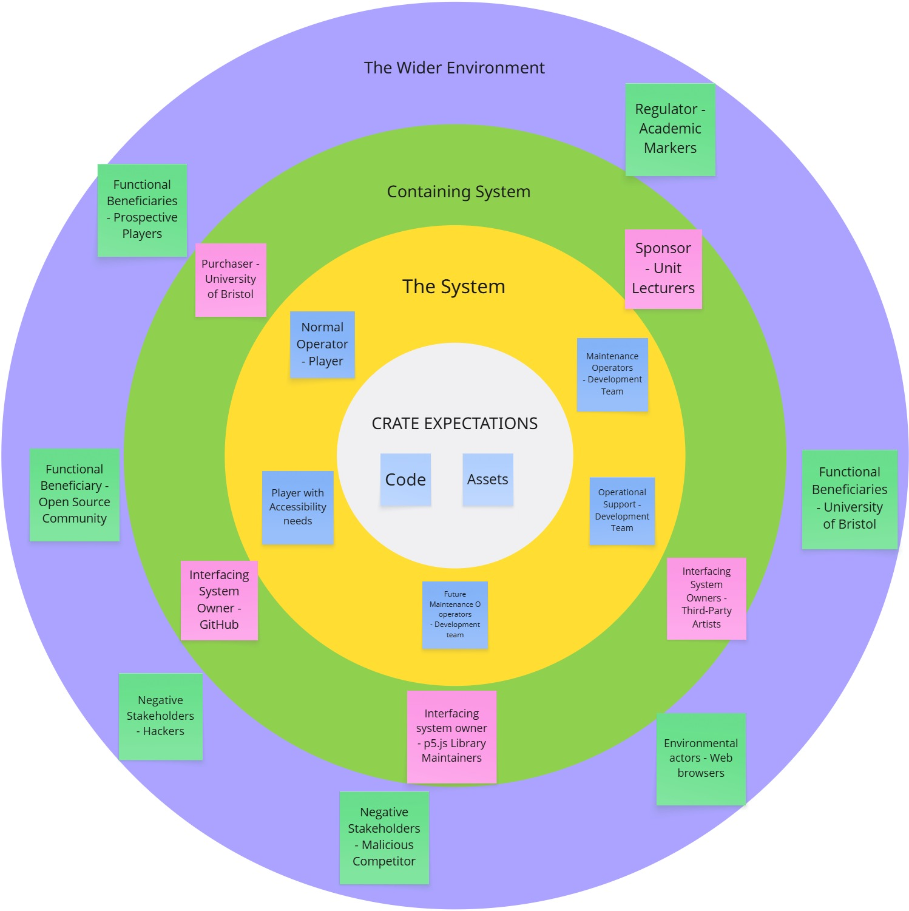
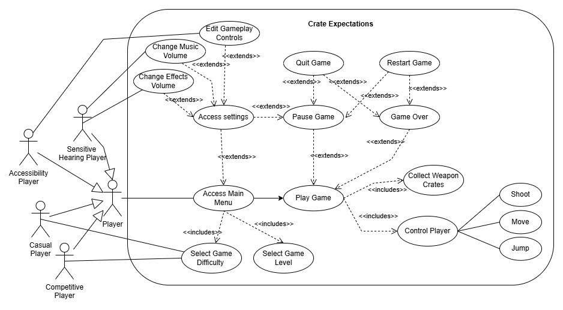

### Initial Genre Brainstorming & Selection Tally

The first stage of our development process was to identify what type of game we wanted to make.
To begin, we discussed what types of games we enjoyed engaging with, and ended up with a list of genres that we all felt had potential. We used dot-voting to rank our preferences, allowing three votes per person. This allowed us to avoid anchoring onto one person's opinion and acted as a natural risk assessment, resulting in the ‘Action-Arcade Platformer’ and ‘Launcher’ genres tied first place.

### Initial Genre Selection Results

| Genre | Total Votes | Status |
| :--- | :---: | :--- |
| **Launcher** | 4 | **Provisionally Selected** |
| **Action-Arcade Platformer** | 4 | **Provisionally Selected** |
| **"Cozy" Sims / Farming Sims** | 3 | High Interest |
| **Roguelike (RPG)** | 3 | High Interest |
| **Puzzles** | 3 | High Interest |
| **Racing** | 2 | Low Interest |
| **Fighting / Action** | 2 | Low Interest |
| **Tower Defense** | 2 | Low Interest |
| **Survival / Crafting** | 1 | Dropped |
| ~~**Horror**~~ | - | Scratched |
| ~~**Exploration**~~ | - | Scratched |

+++Pictures of games from each genre+++
<table>
  <tr>
    <td></td>
    <td></td>
  </tr>
</table>

Not wanting to pick a focus immediately, we explored a range of games from each genre and, through another vote, selected Super Crate Box and Learn 2 Fly as the two ideas that we would bring forward for user testing via a paper prototyping session.

++VIDEOS FOR BOTH PAPER PROTOTYPES HERE++
<table>
  <tr>
    <td></td>
    <td></td>
  </tr>
</table>

During user testing, users much preferred the Super Crate Box style game, noting that it had clearer objectives and more intuitive game mechanics. Our group was also more motivated to pursue this direction, as the Super Crate Box concept offered greater potential for expansion beyond the original, such as introducing new enemies, items, and additional gameplay features.

### Epics and User Stories

to be filled

###  Project Prioritization (MoSCoW Matrix)

| Feature | Effort | Value | MoSCoW Bucket | Rationale |
| :--- | :--- | :--- | :--- | :--- |
| **Core Physics & Gravity** | High | Critical | Must Have | The game is unplayable without stable physics, thus this is required for even the MVP. |
| **Randomized Weapon Crates** | Medium | High | Must Have | This is the main hook of the game, and forms the fundamental gameplay loop .|
| **Multiple Control Schemes** | Low | High | Should Have | Allows players with control related accessiblity needs to optimise their play. |
| **Visual Hit-Flash Feedback** | Low | Medium | Should Have | Aids deaf players who cannot hear the 'hurt' sound effect to play easily. |
| **Pause Menu & State Control** | Low | Medium | Should Have | Important for user control and allowing breaks without losing progress. |
| **Local High Score Saving** | Medium | Medium | Could Have | This would encourage replayability but is not required for an early game iteration. |
| **Online Global Leaderboard** | High | Medium | Won't Have | Leads to high server-side complexity and data protection considerations, with limited interest from playtesters. |
---

### Use Case Diagram
